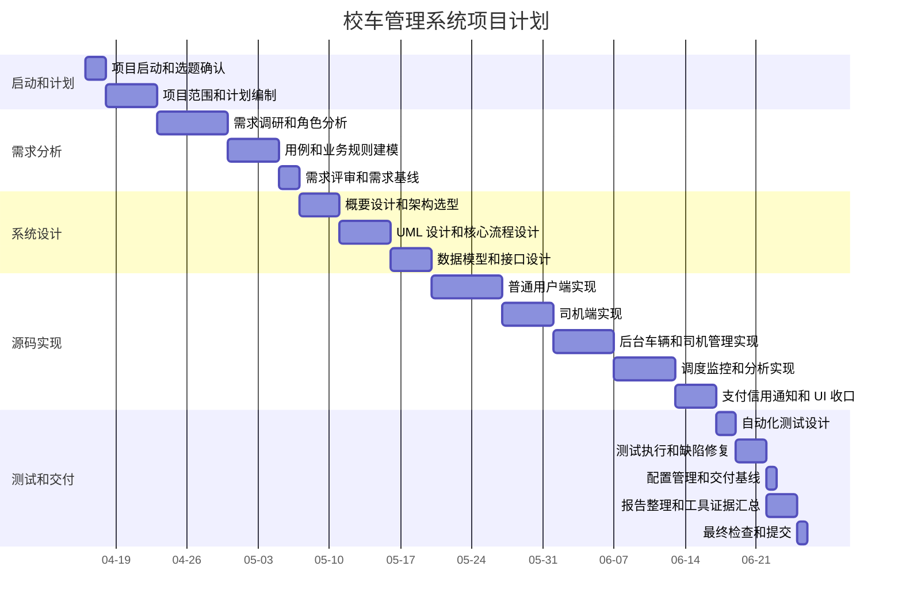

# 项目计划

## 课程工具标识

`[课程工具标识: Microsoft Project/WPS Project/Excel + CSV 导入表 + 甘特图 + Mermaid]` 本部分采用 WBS、进度计划、资源计划、成本计划和风险计划组织项目管理内容。`docs/project_plan_ms_project_import.csv` 可导入 Microsoft Project、WPS Project 或 Excel 生成甘特图，本文档同时保留 Mermaid 甘特图作为报告展示版本。

## 项目基本信息

| 项目 | 内容 |
| --- | --- |
| 项目题目 | 校车管理系统 |
| 项目类型 | Flutter 三端课程原型系统 |
| 计划开始日期 | 2026-04-16 |
| 计划截止日期 | 2026-06-25 |
| 项目范围 | 普通用户端、司机端、后台管理端、Mock 数据闭环、测试和课程报告 |
| 原型边界 | 不包含真实支付商户接入、真实 GPS 权限采集、真实后端正式上线 |

## 项目目标

在 2026-06-25 前完成校车管理系统课程大作业，交付可运行的 Flutter 三端原型、项目计划、需求文档、UML 设计文档、源码说明、测试计划/测试用例/测试报告、配置管理说明、课程工具使用证据和最终项目报告。

## 项目范围

| 范围 | 内容 |
| --- | --- |
| 包含 | 普通用户预约、取消、查看、Mock 支付、信用等级；司机派车任务、日/周/月统计、Mock 实时位置；后台车辆管理、司机管理、人工和 AI 辅助调度、Mock 位置监控、客户 ETA、历史数据分析 |
| 不包含 | 真实支付扣款、真实 GPS 采集、真实地图 SDK、正式后端部署和生产数据库上线 |
| 原型策略 | 以 Mock Repository 保证课程演示和自动化测试闭环，Supabase 相关内容仅作为可切换后端骨架和后续扩展说明 |

## WBS 工作分解

| WBS | 工作包 | 子任务 | 主要交付物 |
| --- | --- | --- | --- |
| 1.0 | 项目启动 | 题目确认、课程要求分析、范围边界确认 | 项目题目、范围说明 |
| 2.0 | 项目计划 | WBS、进度、关键路径、资源、成本、风险、质量和沟通计划 | `docs/01_项目计划.md`、Project CSV |
| 3.0 | 需求分析 | 业务需求、用户需求、功能需求、非功能需求、业务规则、验收标准 | `docs/02_项目需求.md`、用例图、活动图 |
| 4.0 | 系统设计 | 概要设计、详细设计、接口设计、数据设计、模块划分 | `docs/03_项目设计.md`、类图、组件图、顺序图 |
| 5.0 | 源码实现 | Flutter 单工程多入口、Riverpod 状态、GoRouter 路由、Mock Repository | `lib/`、`pubspec.yaml` |
| 6.0 | 测试验证 | 测试计划、测试用例、自动化测试、手工测试记录、缺陷记录 | `test/`、`docs/05_项目测试.md` |
| 7.0 | 配置管理 | Git 基线、依赖锁定、变更控制、提交规范、交付清单 | `docs/06_配置管理.md`、`pubspec.lock` |
| 8.0 | 报告总成 | 课程工具标识、最终报告、README 入口、演示说明 | `docs/07_课程工具使用标识.md`、`docs/08_最终项目报告.md` |

## 进度计划

| ID | 阶段 | 开始 | 结束 | 工期 | 依赖 | 资源 |
| --- | --- | --- | --- | --- | --- | --- |
| 1 | 项目启动和选题确认 | 2026-04-16 | 2026-04-17 | 2 天 | 无 | 项目负责人 |
| 2 | 项目范围和计划编制 | 2026-04-18 | 2026-04-22 | 5 天 | 1 | 项目负责人 |
| 3 | 需求调研和角色分析 | 2026-04-23 | 2026-04-29 | 7 天 | 2 | 需求分析人员 |
| 4 | 用例和业务规则建模 | 2026-04-30 | 2026-05-04 | 5 天 | 3 | 需求分析人员 |
| 5 | 需求评审和需求基线 | 2026-05-05 | 2026-05-06 | 2 天 | 4 | 项目负责人、需求分析人员 |
| 6 | 概要设计和架构选型 | 2026-05-07 | 2026-05-10 | 4 天 | 5 | 开发人员 |
| 7 | UML 设计和核心流程设计 | 2026-05-11 | 2026-05-15 | 5 天 | 6 | 开发人员 |
| 8 | 数据模型和接口设计 | 2026-05-16 | 2026-05-19 | 4 天 | 7 | 开发人员 |
| 9 | 普通用户端实现 | 2026-05-20 | 2026-05-26 | 7 天 | 8 | 开发人员 |
| 10 | 司机端实现 | 2026-05-27 | 2026-05-31 | 5 天 | 8 | 开发人员 |
| 11 | 后台车辆和司机管理实现 | 2026-06-01 | 2026-06-06 | 6 天 | 8 | 开发人员 |
| 12 | 调度、监控和分析实现 | 2026-06-07 | 2026-06-12 | 6 天 | 11 | 开发人员 |
| 13 | 支付、信用、通知和 UI 收口 | 2026-06-13 | 2026-06-16 | 4 天 | 9 | 开发人员 |
| 14 | 自动化测试设计 | 2026-06-17 | 2026-06-18 | 2 天 | 9、10、12、13 | 测试人员 |
| 15 | 测试执行和缺陷修复 | 2026-06-19 | 2026-06-21 | 3 天 | 14 | 测试人员、开发人员 |
| 16 | 配置管理和交付基线 | 2026-06-22 | 2026-06-22 | 1 天 | 15 | 配置管理员 |
| 17 | 报告整理和工具证据汇总 | 2026-06-22 | 2026-06-24 | 3 天 | 15 | 项目负责人 |
| 18 | 最终检查和提交 | 2026-06-25 | 2026-06-25 | 1 天 | 16、17 | 项目负责人 |

## 甘特图

## 里程碑

| 里程碑 | 日期 | 验收标准 |
| --- | --- | --- |
| M1 项目计划完成 | 2026-04-22 | WBS、进度计划、资源计划、成本计划和风险计划完成 |
| M2 需求基线 | 2026-05-06 | 功能需求、非功能需求、业务规则、用例图和需求追踪完成 |
| M3 设计基线 | 2026-05-19 | 架构、模块、接口、数据模型和 UML 设计完成 |
| M4 核心功能完成 | 2026-06-16 | 三端主要功能可运行，Mock 数据流程闭环 |
| M5 测试通过 | 2026-06-21 | 自动化测试通过，关键手工用例完成 |
| M6 最终提交 | 2026-06-25 | 源码、文档、UML、测试和配置管理文件完整 |

## 关键路径说明

关键路径按当前进度表识别为：项目启动和选题确认 → 项目范围和计划编制 → 需求调研和角色分析 → 用例和业务规则建模 → 需求评审和需求基线 → 概要设计和架构选型 → UML 设计和核心流程设计 → 数据模型和接口设计 → 后台车辆和司机管理实现 → 调度、监控和分析实现 → 自动化测试设计 → 测试执行和缺陷修复 → 报告整理和工具证据汇总 → 最终检查和提交。

该路径覆盖后台调度、实时监控和分析模块，因为后台模块依赖车辆、司机、调度需求、位置和分析等核心数据模型，且会影响设计文档、测试文档和最终演示。普通用户端、司机端和支付信用通知模块可与后台实现形成部分并行，但必须在自动化测试设计前完成主流程闭环。

## 资源计划

| 资源角色 | 主要职责 | 投入阶段 | 使用工具 |
| --- | --- | --- | --- |
| 项目负责人 | 范围控制、进度计划、里程碑检查、最终提交 | 全阶段 | Project/WPS Project、Excel、Git、Markdown |
| 需求分析人员 | 角色分析、需求说明、业务规则、验收标准、需求追踪 | 需求阶段、报告整理阶段 | PlantUML、Markdown |
| 开发人员 | Flutter 三端源码、Riverpod 状态、GoRouter 路由、Mock Repository | 设计阶段、实现阶段、缺陷修复阶段 | Flutter、Dart、Android Studio/VS Code |
| 测试人员 | 测试计划、测试用例、自动化测试、手工测试记录、缺陷记录 | 测试阶段 | Flutter Test、WidgetTester |
| 配置管理员 | Git 基线、依赖锁定、交付清单、构建检查 | 配置管理阶段、最终提交阶段 | Git、pubspec.lock、GitHub Actions |

## 成本计划

本项目为课程设计，不发生真实采购成本。成本计划采用“人力工时 + 工具使用成本”的方式估算，用于体现项目管理方法。

| 成本项 | 估算依据 | 数量 | 单价或说明 | 小计 |
| --- | --- | --- | --- | --- |
| 项目管理工时 | 计划、沟通、里程碑检查 | 16 小时 | 课程估算 60 元/小时 | 960 元 |
| 需求和 UML 工时 | 需求文档、用例图、活动图 | 22 小时 | 课程估算 60 元/小时 | 1320 元 |
| 开发工时 | Flutter 三端原型、Mock 数据、路由和状态管理 | 54 小时 | 课程估算 60 元/小时 | 3240 元 |
| 测试工时 | 自动化测试、手工测试、缺陷记录 | 18 小时 | 课程估算 60 元/小时 | 1080 元 |
| 文档总成工时 | 源码说明、配置管理、最终报告 | 20 小时 | 课程估算 60 元/小时 | 1200 元 |
| 工具成本 | Flutter、Dart、Git、PlantUML、VS Code、Project 类工具教学版或替代工具 | 1 批 | 开源或课程环境 | 0 元 |
| 合计 | 课程估算成本 | 130 小时 |  | 7800 元 |

## 沟通计划

| 沟通事项 | 频率 | 参与者 | 产出 |
| --- | --- | --- | --- |
| 课程要求核对 | 项目启动和报告整理时各一次 | 项目负责人、全体成员 | 任务清单、课程工具标识清单 |
| 需求评审 | 需求基线前一次 | 需求分析人员、开发人员、测试人员 | 需求问题记录、需求基线 |
| 设计评审 | 设计基线前一次 | 开发人员、测试人员 | 架构和 UML 调整记录 |
| 测试进度同步 | 测试阶段每日一次 | 开发人员、测试人员 | 缺陷记录和修复状态 |
| 最终提交检查 | 2026-06-25 前一次 | 项目负责人、配置管理员 | 交付清单、运行命令、测试结果 |

## 质量保证计划

| 质量目标 | 保证措施 | 检查方式 |
| --- | --- | --- |
| 文档完整 | 计划、需求、设计、源码、测试、配置管理和最终报告均有独立文件 | 检查 `docs/01` 到 `docs/08` |
| 文档和源码一致 | 需求追踪矩阵和设计映射引用真实 `lib/`、`test/` 路径 | 文件路径抽查 |
| 功能可运行 | 三端通过 `APP_MODE` 启动，Mock 数据可闭环演示 | `flutter run --dart-define=APP_MODE=...` |
| 测试可回归 | 保留 Widget 测试并补充业务规则负向测试 | `flutter test` |
| 代码规范 | 使用 Dart 格式化和 Flutter 静态分析 | `dart format --set-exit-if-changed lib test`、`flutter analyze` |
| 不虚构上线能力 | 文档明确真实支付、真实 GPS、真实后端未正式上线 | 报告边界说明检查 |

## 风险管理计划

| 风险 | 概率 | 影响 | 应对措施 | 责任人 |
| --- | --- | --- | --- | --- |
| 三端功能范围过大 | 中 | 高 | 按核心闭环优先，非核心能力以 Mock 演示和扩展说明呈现 | 项目负责人 |
| 真实支付、GPS、地图接入时间不足 | 高 | 中 | 明确课程原型边界，使用 Mock 支付、Mock 经纬度和 Mock 地图 | 开发人员 |
| 报告和源码不一致 | 中 | 高 | 在需求追踪矩阵和设计映射中引用真实路径，提交前复查 | 需求分析人员、开发人员 |
| Flutter 依赖或环境不一致 | 中 | 中 | 保留 `pubspec.lock`，提供 `flutter pub get`、`flutter analyze`、`flutter test` 命令 | 配置管理员 |
| 自动化测试不稳定 | 中 | 中 | 关键业务规则使用 Provider/Controller 测试，减少 UI 文本歧义 | 测试人员 |
| UML 图片无法在当前环境导出 | 中 | 低 | 保留 PlantUML 源文件和导出命令，最终提交前手工导出 PNG/SVG | 项目负责人 |

## Project/WPS Project/Excel 导入说明

`docs/project_plan_ms_project_import.csv` 是 Project 类工具导入表，字段包括 `ID`、`Task Name`、`Duration`、`Start`、`Finish`、`Predecessors`、`Resource Names`、`Notes`。

导入建议：

1. 使用 Microsoft Project 或 WPS Project 新建空白项目。
2. 将项目开始日期设置为 `2026-04-16`。
3. 导入 `docs/project_plan_ms_project_import.csv`。
4. 将 `Start`、`Finish` 映射为开始和完成日期，将 `Predecessors` 映射为前置任务，将 `Resource Names` 映射为资源名称。
5. 导入后切换到甘特图视图，检查截止日期是否为 `2026-06-25`。
6. 如需在 Excel 中展示，可直接打开 CSV 并按开始/结束日期制作条形甘特图。

## 交付物

| 类型 | 文件或目录 |
| --- | --- |
| 源码 | `lib/`、`test/`、`pubspec.yaml`、`pubspec.lock` |
| 项目计划 | `docs/01_项目计划.md`、`docs/project_plan_ms_project_import.csv` |
| 需求文档 | `docs/02_项目需求.md`、`docs/uml/use_case_diagram.puml`、`docs/uml/passenger_booking_activity.puml` |
| 设计文档 | `docs/03_项目设计.md`、`docs/uml/class_diagram.puml`、`docs/uml/component_diagram.puml`、`docs/uml/driver_location_sequence.puml`、`docs/uml/dispatch_activity.puml` |
| 测试文档 | `docs/05_项目测试.md`、`test/widget_test.dart`、`test/business_rule_test.dart` |
| 配置管理 | `docs/06_配置管理.md` |
| 工具标识 | `docs/07_课程工具使用标识.md` |
| 最终报告 | `docs/08_最终项目报告.md` |
