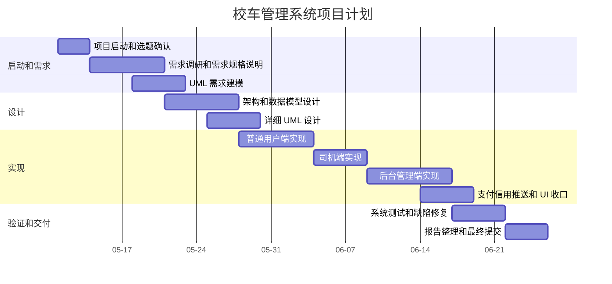

# 项目计划

## 课程工具标识

`[课程工具标识: Microsoft Project/WPS Project/Excel]` 本部分采用 WBS 加甘特图方式完成项目计划。`docs/project_plan_ms_project_import.csv` 可导入 Project 类工具生成甘特图，本文档保留 Mermaid 甘特图作为报告展示版本。

## 项目目标

在 2026-06-25 前完成校车管理系统课程大作业，包括三端 Flutter 原型源码、需求文档、UML 设计文档、测试文档、配置管理文档和最终项目报告。

## 项目范围

| 范围 | 内容 |
| --- | --- |
| 包含 | 普通用户端、司机端、后台管理端、Mock 登录、预约、支付、信用、位置、调度、统计分析 |
| 不包含 | 真实支付商户接入、真实 GPS 权限采集、真实后端服务部署 |
| 原型策略 | 使用 Mock Repository 模拟后端数据，保证课程演示和测试流程闭环 |

## WBS 工作分解

| WBS | 工作包 | 主要交付物 |
| --- | --- | --- |
| 1.0 | 项目启动 | 题目确认、范围说明、技术路线 |
| 2.0 | 需求分析 | 需求说明、用例图、业务规则、验收标准 |
| 3.0 | 概要设计 | 架构设计、模块划分、核心数据模型 |
| 4.0 | 详细设计 | 活动图、类图、顺序图、调度算法设计 |
| 5.0 | 源码实现 | Flutter 三端原型、Mock 数据仓库、路由和状态管理 |
| 6.0 | 系统测试 | 测试计划、测试用例、自动化测试、测试报告 |
| 7.0 | 配置管理 | Git 基线、版本标识、变更记录、交付清单 |
| 8.0 | 报告整理 | 项目报告、UML 文件、演示说明、最终提交包 |

## 进度计划

| 阶段 | 开始 | 结束 | 工期 | 依赖 | 负责人 |
| --- | --- | --- | --- | --- | --- |
| 项目启动和选题确认 | 2026-05-11 | 2026-05-13 | 3 天 | 无 | 项目成员 |
| 需求调研和需求规格说明 | 2026-05-14 | 2026-05-20 | 7 天 | 项目启动 | 项目成员 |
| UML 需求建模 | 2026-05-18 | 2026-05-22 | 5 天 | 需求调研 | 项目成员 |
| 架构和数据模型设计 | 2026-05-21 | 2026-05-27 | 7 天 | 需求规格说明 | 项目成员 |
| 普通用户端实现 | 2026-05-28 | 2026-06-03 | 7 天 | 架构设计 | 项目成员 |
| 司机端实现 | 2026-06-04 | 2026-06-08 | 5 天 | 架构设计 | 项目成员 |
| 后台管理端实现 | 2026-06-09 | 2026-06-16 | 8 天 | 架构设计 | 项目成员 |
| 支付、信用、推送和 UI 收口 | 2026-06-14 | 2026-06-18 | 5 天 | 用户端实现 | 项目成员 |
| 系统测试和缺陷修复 | 2026-06-17 | 2026-06-21 | 5 天 | 三端实现 | 项目成员 |
| 报告整理和最终提交 | 2026-06-22 | 2026-06-25 | 4 天 | 测试完成 | 项目成员 |

## 甘特图

## 里程碑

| 里程碑 | 日期 | 验收标准 |
| --- | --- | --- |
| M1 需求冻结 | 2026-05-20 | 完成功能需求、业务规则和用例图 |
| M2 设计冻结 | 2026-05-27 | 完成架构、数据模型和 UML 设计 |
| M3 核心功能完成 | 2026-06-16 | 三端主要功能可运行 |
| M4 测试通过 | 2026-06-21 | 自动化测试通过，关键手工用例通过 |
| M5 最终提交 | 2026-06-25 | 源码和报告文件完整归档 |

## 人员和资源计划

| 角色 | 职责 | 工具 |
| --- | --- | --- |
| 项目负责人 | 范围控制、进度计划、最终提交 | Project、Git |
| 需求分析人员 | 需求说明、用例分析、验收标准 | PlantUML、Markdown |
| 开发人员 | Flutter 三端源码实现 | Flutter、Dart、VS Code 或 Android Studio |
| 测试人员 | 测试计划、测试用例、自动化测试 | Flutter Test、WidgetTester |
| 配置管理员 | 版本基线、依赖锁定、发布归档 | Git、pubspec.lock |

## 风险计划

| 风险 | 概率 | 影响 | 应对措施 |
| --- | --- | --- | --- |
| 真实支付和地图接口接入时间不足 | 中 | 高 | 采用 Mock 支付和 Mock 地图完成课程演示，设计中保留真实接口扩展点 |
| 三端功能范围过大 | 中 | 高 | 按 P0 到 P5 分阶段实现，优先保证核心闭环 |
| Flutter 环境或依赖版本冲突 | 低 | 中 | 锁定 `pubspec.lock`，提交运行命令和测试结果 |
| 报告和源码不一致 | 中 | 中 | 文档中引用真实源码路径，并在提交前执行测试 |
| 截止日前缺陷未修复 | 低 | 高 | 设置 2026-06-21 测试冻结，预留 4 天报告和修复缓冲 |

## 交付物

| 类型 | 文件或目录 |
| --- | --- |
| 源码 | `lib/`、`test/`、`pubspec.yaml` |
| 项目计划 | `docs/01_项目计划.md`、`docs/project_plan_ms_project_import.csv` |
| 需求文档 | `docs/02_项目需求.md`、`docs/uml/use_case_diagram.puml` |
| 设计文档 | `docs/03_项目设计.md`、`docs/uml/*.puml` |
| 测试文档 | `docs/05_项目测试.md` |
| 配置管理 | `docs/06_配置管理.md` |
| 总报告 | `docs/00_项目报告总览.md` |
