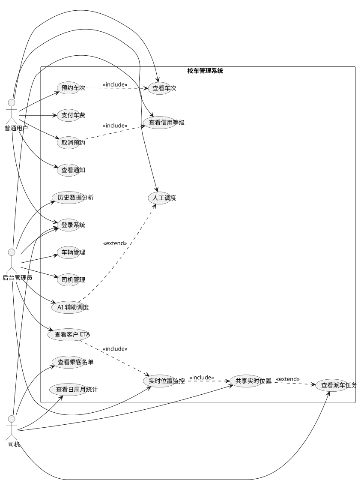
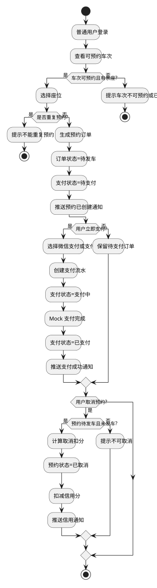
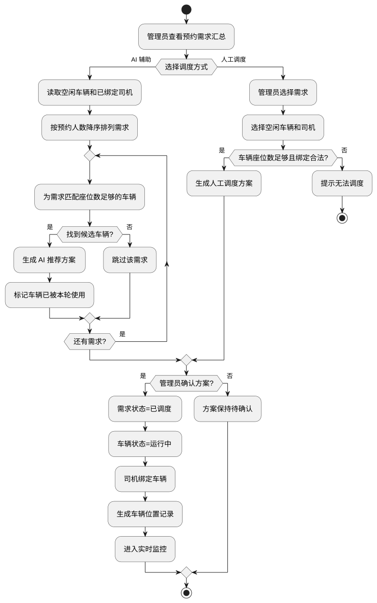
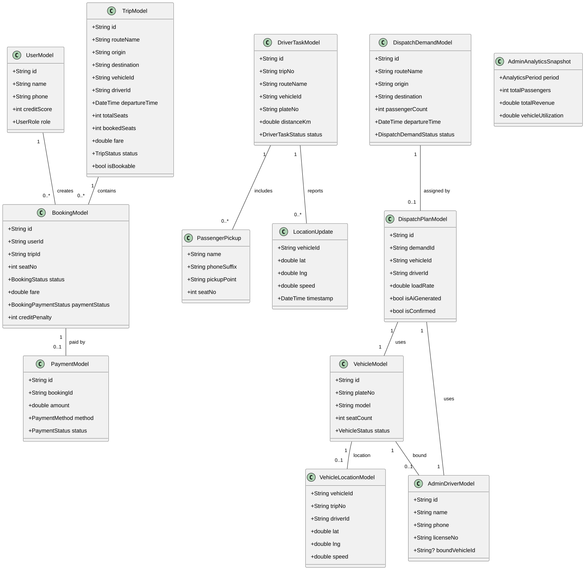
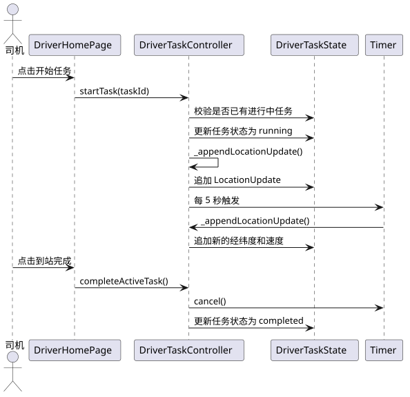
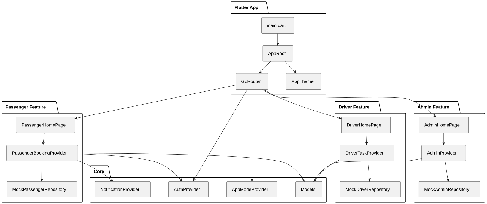

# 校车管理系统 —— 项目需求文档

> **课程**：软件开发环境与工具  
> **项目**：校车管理系统 (BUS-FLUTTER)  
> **文档类型**：项目需求规格说明书  
> **工具标识**：`[UML/PlantUML + Markdown 需求规格说明 + 需求追踪矩阵]`

---

## 目录

1. [需求背景](#1-需求背景)
2. [用户角色分析](#2-用户角色分析)
3. [UML 用例建模](#3-uml-用例建模)
4. [业务需求](#4-业务需求)
5. [功能需求](#5-功能需求)
6. [UML 活动图 —— 业务流程建模](#6-uml-活动图--业务流程建模)
7. [UML 类图 —— 数据模型](#7-uml-类图--数据模型)
8. [UML 顺序图 —— 交互流程](#8-uml-顺序图--交互流程)
9. [UML 组件图 —— 系统架构](#9-uml-组件图--系统架构)
10. [非功能需求](#10-非功能需求)
11. [业务规则](#11-业务规则)
12. [数据字典](#12-数据字典)
13. [需求追踪矩阵](#13-需求追踪矩阵)
14. [验收标准](#14-验收标准)

---

## 1. 需求背景

### 1.1 项目背景

校园内跨校区、宿舍区、教学楼、科技园、附属医院等场景存在大量通勤需求。传统校车预约依赖人工统计，存在以下痛点：

| 痛点 | 表现 |
|------|------|
| 预约数据不透明 | 学生无法实时了解车次余座，人工登记效率低下 |
| 司机通知滞后 | 派车任务靠电话/微信通知，缺乏系统化管理 |
| 调度缺乏数据支撑 | 空车或超载风险高，车辆利用率无法评估 |
| 后台无法实时监控 | 车辆运行状态、位置、客户到达时间不可见 |

### 1.2 项目定位

本项目是《软件开发环境与工具》课程大作业原型系统：

- **开发框架**：Flutter/Dart，使用 Riverpod 状态管理 + GoRouter 路由
- **三端闭环**：普通用户端、司机端、后台管理端，通过 `APP_MODE` 环境变量切换
- **数据策略**：当前使用 Mock Repository 提供演示数据；支付、GPS、地图均为 Mock 或可切换骨架
- **后端扩展**：预留 Supabase 接入方案，支持分阶段取消 Mock

### 1.3 项目范围

```
┌─────────────────────────────────────────────────────┐
│                  校车管理系统                          │
├───────────────┬───────────────┬─────────────────────┤
│  普通用户端    │    司机端      │     后台管理端        │
├───────────────┼───────────────┼─────────────────────┤
│ · 登录/注册    │ · 登录        │ · 车辆管理            │
│ · 查看车次    │ · 查看任务     │ · 司机管理            │
│ · 预约座位    │ · 乘客名单     │ · 人工调度            │
│ · 支付车费    │ · 位置共享     │ · AI 辅助调度          │
│ · 取消预约    │ · 任务统计     │ · 实时位置监控         │
│ · 信用等级    │               │ · 客户 ETA            │
│ · 通知中心    │               │ · 历史数据分析         │
└───────────────┴───────────────┴─────────────────────┘
```

---

## 2. 用户角色分析

| 角色 | 标识 | 说明 | 核心目标 |
|------|------|------|----------|
| **普通用户** | Passenger | 学生或教职工乘客 | 查询车次、预约座位、支付车费、取消预约、查看信用等级和通知 |
| **司机** | Driver | 校车驾驶员 | 查看派车任务、查看乘客名单和上车点、发车后共享 Mock 实时位置、查看任务统计 |
| **后台管理员** | Admin | 校车运营管理人员 | 管理车辆司机、调度车次、监控车辆、查看客户 ETA、分析运营数据 |

---

## 3. UML 用例建模

### 3.1 用例图

用例图从**参与者视角**描述了系统提供的功能。下图展示了普通用户、司机、后台管理员与校车管理系统之间的交互关系。



**PlantUML 源文件**：`docs/uml/use_case_diagram.puml`

### 3.2 用例图说明

图中包含三种参与者和 16 个用例，用例之间存在以下关系：

| 关系类型 | 源用例 | 目标用例 | 说明 |
|----------|--------|----------|------|
| `<<include>>` | 预约车次 | 查看车次 | 预约前必须先查看车次信息 |
| `<<include>>` | 取消预约 | 信用等级 | 取消操作自动触发信用扣分 |
| `<<extend>>` | 共享实时位置 | 查看派车任务 | 发车后可选共享位置 |
| `<<include>>` | 实时位置监控 | 共享实时位置 | 后台监控依赖司机位置上报 |
| `<<include>>` | 查看客户 ETA | 实时位置监控 | ETA 基于实时位置计算 |
| `<<extend>>` | AI 辅助调度 | 人工调度 | AI 是人工调度的智能化扩展 |

### 3.3 用例清单

| 用例编号 | 用例名称 | 参与者 | 优先级 | 触发条件 |
|----------|----------|--------|--------|----------|
| UC-01 | 登录系统 | 全部角色 | 高 | 用户启动应用 |
| UC-02 | 查看车次 | 普通用户 | 高 | 进入乘客首页 |
| UC-03 | 预约车次 | 普通用户 | 高 | 选择可预约车次 |
| UC-04 | 支付车费 | 普通用户 | 高 | 生成待支付订单 |
| UC-05 | 取消预约 | 普通用户 | 高 | 主动取消待发车预约 |
| UC-06 | 查看信用等级 | 普通用户 | 中 | 进入信用面板 |
| UC-07 | 查看通知 | 普通用户 | 中 | 进入通知中心 |
| UC-08 | 查看派车任务 | 司机 | 高 | 进入司机首页 |
| UC-09 | 查看乘客名单 | 司机 | 高 | 点击任务详情 |
| UC-10 | 共享实时位置 | 司机 | 高 | 点击开始任务 |
| UC-11 | 查看任务统计 | 司机 | 中 | 进入统计面板 |
| UC-12 | 车辆管理 | 管理员 | 高 | 进入后台车辆 TAB |
| UC-13 | 司机管理 | 管理员 | 高 | 进入后台司机 TAB |
| UC-14 | 人工调度 | 管理员 | 高 | 进入调度面板 |
| UC-15 | AI 辅助调度 | 管理员 | 高 | 在调度面板选择 AI 模式 |
| UC-16 | 实时位置监控 | 管理员 | 高 | 进入监控面板 |
| UC-17 | 查看客户 ETA | 管理员 | 高 | 在监控面板点击车辆标记 |
| UC-18 | 历史数据分析 | 管理员 | 中 | 进入分析面板 |

---

## 4. 业务需求

业务需求（Business Requirement, BRQ）从**高层视角**定义系统应实现的业务目标。

| 编号 | 业务需求 | 详细说明 | 关联用例 |
|------|----------|----------|----------|
| BRQ-01 | 提升校车预约效率 | 普通用户可在移动端查看车次、预约座位、取消预约和支付车费，减少人工登记环节 | UC-02~UC-05 |
| BRQ-02 | 提升司机任务透明度 | 司机可查看派车任务、乘客上车点和日/周/月统计，便于执行运营任务 | UC-08~UC-11 |
| BRQ-03 | 支持调度决策 | 后台可根据预约需求进行人工调度和 AI 辅助调度，降低空车或超载风险 | UC-14~UC-15 |
| BRQ-04 | 掌握运行状态 | 后台可查看车辆和司机 Mock 实时位置、车次状态、客户距离和预计到达时间 | UC-16~UC-17 |
| BRQ-05 | 支持运营复盘 | 后台可查看历史运营数据，辅助分析路线热度、收入和车辆利用率 | UC-18 |
| BRQ-06 | 满足课程交付要求 | 项目需包含计划、需求、设计、源码、测试、配置管理和工具使用证据 | — |

---

## 5. 功能需求

功能需求（Functional Requirement, FR）描述系统应提供的**具体功能**，每个需求均包含说明、输入、处理、输出和源码路径。

### FR-01 登录和角色入口

```
┌──────────┬────────────────────────────────────────────────┐
│ 说明     │ 系统支持普通用户、司机、后台管理员三种角色登录        │
│ 输入     │ 手机号、密码、当前入口模式（APP_MODE）              │
│ 处理     │ 校验 Mock 账号密码和角色是否匹配当前入口             │
│ 输出     │ 登录成功 → 对应工作台；失败 → 错误提示              │
│ 源码     │ lib/features/auth/                              │
│          │ lib/core/router/app_router.dart                  │
└──────────┴────────────────────────────────────────────────┘
```

### FR-02 ~ FR-14 功能需求总表

| 编号 | 功能 | 用户角色 | 输入 | 输出 | 优先级 |
|------|------|----------|------|------|--------|
| FR-01 | 登录和角色入口 | 全部 | 手机号、密码、入口模式 | 对应工作台 / 错误提示 | 高 |
| FR-02 | 预约车次 | 普通用户 | 车次ID、座位号、用户ID | 预约订单（待发车、待支付） | 高 |
| FR-03 | 查看和筛选预约 | 普通用户 | 用户ID、状态筛选 | 预约列表（含车次、座位、费用） | 高 |
| FR-04 | 取消预约和信用扣分 | 普通用户 | 预约ID | 已取消状态 + 信用扣分记录 | 高 |
| FR-05 | 支付车费 | 普通用户 | 预约ID、支付方式 | Mock 支付流水 + 支付成功通知 | 高 |
| FR-06 | 信用等级和通知 | 普通用户 | 信用分、通知列表 | 信用面板 + 通知中心 | 中 |
| FR-07 | 查看派车任务 | 司机 | 司机ID | 车次、路线、乘客名单、上车点 | 高 |
| FR-08 | 任务统计 | 司机 | 统计周期 | 人次、里程、准点率看板 | 中 |
| FR-09 | 实时位置共享 | 司机 | 任务ID | 每5秒Mock位置上报 → 监控端 | 高 |
| FR-10 | 车辆管理 | 管理员 | 车牌号、车型、座位数 | 车辆列表更新 / 错误提示 | 高 |
| FR-11 | 司机管理 | 管理员 | 姓名、手机号、驾照号、绑定车辆 | 司机列表更新 / 错误提示 | 高 |
| FR-12 | 人工和AI调度 | 管理员 | 待调度需求、空闲车辆 | 调度方案（人工/AI生成） | 高 |
| FR-13 | 位置监控和客户ETA | 管理员 | 车辆实时位置 | 地图标记 + 车辆详情 + ETA列表 | 高 |
| FR-14 | 历史数据分析 | 管理员 | 统计周期 | 人次、收入、利用率、路线热度 | 中 |

---

## 6. UML 活动图 —— 业务流程建模

### 6.1 乘客预约-支付-取消活动图

该活动图描述了普通用户从浏览车次到完成预约（含支付和取消分支）的完整流程。



**PlantUML 源文件**：`docs/uml/passenger_booking_activity.puml`

**流程说明**：

```
开始
  │
  ├─→ 普通用户登录
  │
  ├─→ 查看可预约车次
  │     │
  │     ├─[车次可预约且有余座]─→ 选择座位
  │     │     │
  │     │     ├─[重复预约]─→ 提示错误 → 结束
  │     │     │
  │     │     └─[正常]─→ 生成预约订单
  │     │                  │
  │     │                  ├─→ 订单状态=待发车
  │     │                  ├─→ 支付状态=待支付
  │     │                  └─→ 推送预约通知
  │     │                        │
  │     │                        ├─[立即支付]─→ 选择支付方式(微信/支付宝)
  │     │                        │                │
  │     │                        │                ├─→ 创建支付流水
  │     │                        │                ├─→ Mock支付(500ms)
  │     │                        │                └─→ 支付成功通知
  │     │                        │
  │     │                        └─[暂不支付]─→ 保留待支付订单
  │     │
  │     └─[不可预约/满座]─→ 提示 → 结束
  │
  └─→ [用户取消预约]
        │
        ├─[预约待发车且未发车]─→ 计算扣分规则
        │                        │
        │                        ├─→ 距发车≤2h：扣5分
        │                        ├─→ 距发车>2h：扣2分
        │                        │
        │                        ├─→ 状态=已取消
        │                        ├─→ 扣减信用分
        │                        └─→ 推送信用通知
        │
        └─[不满足取消条件]─→ 提示不可取消

结束
```

### 6.2 调度活动图

该活动图描述了后台管理员执行人工调度和 AI 辅助调度的完整决策流程。



**PlantUML 源文件**：`docs/uml/dispatch_activity.puml`

**流程说明**：

1. 管理员查看预约需求汇总（含路线、人数、时间）
2. **分支选择**：
   - **AI 辅助模式**：系统读取空闲车辆和已绑定司机 → 按预约人数降序排列需求 → 贪心匹配座位数足够的车辆 → 标记已使用的车辆 → 生成 AI 推荐方案
   - **人工调度模式**：管理员手动选择需求 → 选择空闲车辆和司机 → 校验座位数和绑定合法性 → 生成人工调度方案
3. 管理员确认方案 → 需求状态=已调度 → 车辆状态=运行中 → 司机绑定车辆 → 进入实时位置监控

---

## 7. UML 类图 —— 数据模型

### 7.1 核心类图

类图展示了校车管理系统中核心数据模型及其关系。



**PlantUML 源文件**：`docs/uml/class_diagram.puml`

### 7.2 核心类说明

| 类名 | 对应源码 | 职责 | 关键字段 |
|------|----------|------|----------|
| `UserModel` | `user_model.dart` | 用户身份与信用 | id, name, phone, creditScore, role |
| `TripModel` | `trip_model.dart` | 可预约车次 | id, routeName, departureTime, totalSeats, fare, status |
| `BookingModel` | `booking_model.dart` | 预约订单 | id, userId, tripId, seatNo, status, paymentStatus, creditPenalty |
| `PaymentModel` | `payment_model.dart` | 支付流水 | id, bookingId, amount, method, status |
| `DriverTaskModel` | `driver_task_model.dart` | 司机任务 | id, tripNo, routeName, vehicleId, distanceKm, status |
| `VehicleModel` | `vehicle_model.dart` | 车辆信息 | id, plateNo, model, seatCount, status |
| `AdminDriverModel` | `admin_driver_model.dart` | 司机档案 | id, name, phone, licenseNo, boundVehicleId |
| `DispatchPlanModel` | `dispatch_model.dart` | 调度方案 | demandId, vehicleId, driverId, loadRate, isAiGenerated, isConfirmed |
| `VehicleLocationModel` | `vehicle_location_model.dart` | 实时位置 | vehicleId, lat, lng, speed, driverId |
| `AdminAnalyticsSnapshot` | `analytics_model.dart` | 运营分析 | period, totalPassengers, totalRevenue, vehicleUtilization |

### 7.3 类关系说明

```
UserModel (1) ────────── (0..*) BookingModel      用户可创建多个预约
TripModel  (1) ────────── (0..*) BookingModel      车次可被多次预约
BookingModel (1) ──────── (0..1) PaymentModel      一个预约对应一笔支付
DriverTaskModel (1) ───── (0..*) PassengerPickup    一个任务包含多个乘客上车点
DriverTaskModel (1) ───── (0..*) LocationUpdate     一个任务产生多个位置记录
VehicleModel (1) ──────── (0..1) AdminDriverModel   车辆与司机一对一绑定
DispatchPlanModel (1) ─── (1) VehicleModel           调度方案使用一辆车
DispatchPlanModel (1) ─── (1) AdminDriverModel       调度方案指定一位司机
```

---

## 8. UML 顺序图 —— 交互流程

### 8.1 司机实时位置共享顺序图

该顺序图描述了司机从开始任务、周期性上报位置到到站完成的完整交互流程。



**PlantUML 源文件**：`docs/uml/driver_location_sequence.puml`

**交互流程说明**：

| 步骤 | 参与者 | 动作 | 说明 |
|------|--------|------|------|
| 1 | 司机 → DriverHomePage | 点击"开始任务" | 触发发车操作 |
| 2 | Page → Controller | `startTask(taskId)` | 调用任务控制器 |
| 3 | Controller → State | 校验进行中任务 | 确保无冲突任务 |
| 4 | Controller → State | 更新状态为 running | 标记任务运行中 |
| 5 | Controller → Controller | `_appendLocationUpdate()` | 首次位置上报 |
| 6 | Controller → State | 追加 LocationUpdate | 记录初始位置 |
| 7 | Controller → Timer | 启动每5秒定时器 | 周期性位置模拟 |
| 8 | Timer → Controller | 每5秒回调 | 模拟经纬度和速度 |
| 9 | 司机 → Page | 点击"到站完成" | 触发结束操作 |
| 10 | Page → Controller | `completeActiveTask()` | 调用完成方法 |
| 11 | Controller → Timer | `cancel()` | 停止位置上报 |
| 12 | Controller → State | 更新状态为 completed | 任务完成 |

---

## 9. UML 组件图 —— 系统架构

### 9.1 组件图

该组件图描述了 Flutter 应用的组件依赖关系，体现了 `core → features → shared` 的分层架构。



**PlantUML 源文件**：`docs/uml/component_diagram.puml`

### 9.2 组件分层说明

```
┌─────────────────────────────────────────────────────┐
│                   Flutter App 层                      │
│  main.dart → AppRoot → GoRouter / AppTheme           │
├──────────┬───────────────┬──────────────────────────┤
│ Passenger│    Driver     │         Admin             │
│  Feature │   Feature     │        Feature            │
│  ┌─────┐ │   ┌─────┐    │        ┌─────┐            │
│  │Page │ │   │Page │    │        │Page │            │
│  │Prov.│ │   │Prov.│    │        │Prov.│            │
│  │Repo │ │   │Repo │    │        │Repo │            │
│  └─────┘ │   └─────┘    │        └─────┘            │
├──────────┴───────────────┴──────────────────────────┤
│                   Core 层                             │
│  Models │ AuthProvider │ NotificationProvider        │
│  AppModeProvider │ Theme │ Router                    │
└─────────────────────────────────────────────────────┘
```

- **Flutter App 层**：入口和主题配置
- **Feature 层**：三个独立功能模块（Passenger / Driver / Admin），各自包含 Page、Provider、Repository
- **Core 层**：共享的数据模型（Models）和通用 Provider（认证、通知、模式切换）

---

## 10. 非功能需求

| 编号 | 类别 | 需求描述 | 验证方式 |
|------|------|----------|----------|
| NFR-01 | 易用性 | 三端工作台采用卡片式布局，核心操作按钮明确 | 手工测试 + Widget 测试 |
| NFR-02 | 可维护性 | 按 `core`、`features`、`shared` 分层组织代码，业务逻辑放在 Provider 中 | 源码结构检查 |
| NFR-03 | 可测试性 | 关键流程提供 Widget 自动化测试和业务规则测试 | `flutter test` |
| NFR-04 | 可扩展性 | Mock Repository 可替换为 REST API、WebSocket、真实支付和地图服务 | 设计文档审查 |
| NFR-05 | 响应式 | 页面使用 `LayoutBuilder` 和 `SingleChildScrollView` 适配不同屏幕 | 多尺寸手工测试 |
| NFR-06 | 性能 | 位置上报定时器精确到 5 秒，Mock 支付延迟 ≤ 500ms | 代码审查 |
| NFR-07 | 安全 | 当前为课程原型不含真实敏感数据；正式版本应增加加密和权限控制 | 文档边界说明 |

---

## 11. 业务规则

| 编号 | 规则描述 | 触发场景 | 后果 |
|------|----------|----------|------|
| RUL-01 | 用户只能登录与当前入口一致的角色 | 登录校验 | 手机号或密码错误时提示 |
| RUL-02 | 只有待发车且未过发车时间的车次可预约 | 预约校验 | 不符合条件时提示不可预约 |
| RUL-03 | 同一用户不能重复预约同一车次 | 预约去重 | 提示已预约该车次 |
| RUL-04 | 只有待发车状态的预约可以取消 | 取消校验 | 已发车/已完成订单不可取消 |
| RUL-05 | 距发车≤2小时取消扣5分，>2小时扣2分 | 取消扣分 | 信用分减少并记录 |
| RUL-06 | 只有待支付且待发车的预约可以支付 | 支付校验 | 已支付/已取消订单不可支付 |
| RUL-07 | 运行中车辆不可删除 | 车辆删除校验 | 提示先完成或取消任务 |
| RUL-08 | 在途司机不可删除 | 司机删除校验 | 提示司机有进行中任务 |
| RUL-09 | 车辆与司机保持一对一绑定 | 司机绑定车辆 | 已有绑定的车辆不可再绑定其他司机 |
| RUL-10 | 调度车辆必须为空闲状态，座位数≥预约人数 | 调度校验 | 不满足条件拒绝生成方案 |
| RUL-11 | AI调度只选空闲且已绑定司机的车辆 | AI 调度 | 无候选车辆时返回失败提示 |

---

## 12. 数据字典

| 数据对象 | 源码文件 | 关键字段 | 字段说明 |
|----------|----------|----------|----------|
| User | `user_model.dart` | id, name, phone, creditScore, role | 用户身份和信用积分 |
| Trip | `trip_model.dart` | id, routeName, origin, destination, departureTime, totalSeats, bookedSeats, fare, status | 可预约车次 |
| Booking | `booking_model.dart` | id, userId, tripId, seatNo, status, paymentStatus, creditPenalty | 预约订单 |
| Payment | `payment_model.dart` | id, bookingId, amount, method, status | Mock 支付流水 |
| DriverTask | `driver_task_model.dart` | id, tripNo, routeName, vehicleId, plateNo, distanceKm, status | 司机派车任务 |
| Vehicle | `vehicle_model.dart` | id, plateNo, model, seatCount, status | 车辆信息 |
| Driver | `admin_driver_model.dart` | id, name, phone, licenseNo, boundVehicleId | 司机档案 |
| DispatchPlan | `dispatch_model.dart` | demandId, vehicleId, driverId, passengerCount, loadRate, isAiGenerated, isConfirmed | 调度方案 |
| VehicleLocation | `vehicle_location_model.dart` | vehicleId, tripNo, driverId, lat, lng, speed | 实时位置 |
| Analytics | `analytics_model.dart` | period, totalPassengers, totalRevenue, vehicleUtilization, trend, routeRanking | 运营分析 |

---

## 13. 需求追踪矩阵

需求追踪矩阵建立了**需求 → 设计 → 源码 → 测试**的完整追溯链。

| 需求编号 | 需求简述 | 设计模块 | 源码路径 | 测试用例 |
|----------|----------|----------|----------|----------|
| FR-01 | 登录和角色入口 | 入口和路由设计 | `lib/features/auth/` | TC-01, TC-05, TC-18 |
| FR-02 | 预约车次 | 乘客端设计 | `lib/features/passenger/booking/` | TC-02, TC-19 |
| FR-03 | 查看筛选预约 | 乘客端设计 | `passenger_home_page.dart` | TC-01 |
| FR-04 | 取消预约信用扣分 | 取消规则设计 | `passenger_booking_provider.dart` | TC-03, TC-20 |
| FR-05 | 支付车费 | Mock支付流程 | `payment_model.dart` | TC-04 |
| FR-06 | 信用等级和通知 | 通知设计 | `notification_provider.dart` | TC-03, TC-04 |
| FR-07 | 司机查看任务 | 司机任务模块 | `driver_home_page.dart` | TC-05 |
| FR-08 | 司机任务统计 | 统计看板模块 | `driver_task_provider.dart` | TC-05 |
| FR-09 | 实时位置共享 | 位置共享模块 | `location_update.dart` | TC-06~08 |
| FR-10 | 车辆管理 | 车辆管理模块 | `admin_provider.dart` | TC-09, TC-10, TC-21 |
| FR-11 | 司机管理 | 司机管理模块 | `admin_driver_model.dart` | TC-11, TC-22 |
| FR-12 | 人工和AI调度 | 调度模块 | `dispatch_model.dart` | TC-12, TC-13, TC-23, TC-24 |
| FR-13 | 位置监控和ETA | 监控模块 | `vehicle_location_model.dart` | TC-14~16 |
| FR-14 | 历史数据分析 | 分析模块 | `analytics_model.dart` | TC-17 |

---

## 14. 验收标准

| 编号 | 验收项 | 验收方式 | 通过条件 |
|------|--------|----------|----------|
| AC-01 | 普通用户主流程 | 自动化测试 + 手工演示 | 登录→预约→支付→取消 全流程可走通 |
| AC-02 | 司机任务流程 | 自动化测试 + 手工演示 | 登录→查看任务→开始任务→位置上报→完成任务 |
| AC-03 | 管理员调度流程 | 自动化测试 + 手工演示 | 维护车辆司机→生成调度方案→确认生效 |
| AC-04 | 实时监控功能 | 自动化测试 + 手工演示 | 查看车辆位置、司机详情、客户ETA |
| AC-05 | 历史数据分析 | 自动化测试 + 手工演示 | 日/周/月数据切换和图表展示 |
| AC-06 | 文档完整性 | 文件检查 | 计划、需求、设计、源码、测试、配置管理、最终报告七份文档齐全 |
| AC-07 | 工具标识规范 | 文件检查 | 每个报告部分包含课程工具标识和证据路径 |

---

> **文档版本**：v1.0  
> **生成日期**：2026-05-31  
> **UML 源文件**：`docs/uml/*.puml`  
> **UML 导出图**：`docs/uml/out/*.svg`  
> **工具链**：PlantUML (UML建模) + Markdown (文档编写) + Git (版本管理)
