# 校车管理系统 —— 项目需求文档

> **课程**：软件开发环境与工具  
> **项目**：校车管理系统 (BUS-FLUTTER)  
> **文档类型**：项目需求规格说明书  
> **工具标识**：`[StarUML + Markdown 需求规格说明]`  
> **UML 源文件**：`docs/uml/BUS-FLUTTER-UML.mdj`

---

## 目录

1. [需求背景](#1-需求背景)
2. [用户角色分析](#2-用户角色分析)
3. [UML 用例图](#3-uml-用例图)
4. [业务需求](#4-业务需求)
5. [功能需求](#5-功能需求)
6. [UML 类图](#6-uml-类图)
7. [UML 状态图](#7-uml-状态图)
8. [UML 时序图](#8-uml-时序图)
9. [UML 部署图](#9-uml-部署图)
10. [UML 组件图](#10-uml-组件图)
11. [非功能需求](#11-非功能需求)
12. [业务规则](#12-业务规则)
13. [数据字典](#13-数据字典)
14. [需求追踪矩阵](#14-需求追踪矩阵)
15. [验收标准](#15-验收标准)
16. [UML 图片导出指南](#16-uml-图片导出指南)

---

## 1. 需求背景

### 1.1 项目背景

校园内跨校区、宿舍区、教学楼、科技园、附属医院等场景存在大量通勤需求。传统校车预约依赖人工统计，存在以下痛点：

| 痛点 | 表现 |
|------|------|
| 预约数据不透明 | 学生无法实时了解车次余座，人工登记效率低下 |
| 司机通知滞后 | 派车任务靠电话/微信通知，缺乏系统化管理 |
| 调度缺乏数据支撑 | 空车或超载风险高，车辆利用率无法评估 |
| 后台无法实时监控 | 车辆运行状态、位置、客户到达时间不可见 |

### 1.2 项目定位

本项目是《软件开发环境与工具》课程大作业原型系统：

- **开发框架**：Flutter/Dart，使用 Riverpod 状态管理 + GoRouter 路由
- **三端闭环**：普通用户端、司机端、后台管理端，通过 `APP_MODE` 环境变量切换
- **数据策略**：当前使用 Mock Repository 提供演示数据；支付、GPS、地图均为 Mock 或可切换骨架
- **后端扩展**：预留 Supabase 接入方案，支持分阶段取消 Mock

### 1.3 项目范围

```
┌─────────────────────────────────────────────────────────┐
│                      校车管理系统                          │
├─────────────────┬─────────────────┬──────────────────────┤
│    普通用户端     │      司机端      │      后台管理端        │
├─────────────────┼─────────────────┼──────────────────────┤
│ · 登录/注册      │ · 登录           │ · 车辆管理             │
│ · 查看车次       │ · 查看任务       │ · 司机管理             │
│ · 预约座位       │ · 乘客名单       │ · 人工调度             │
│ · 支付车费       │ · 位置共享       │ · AI 辅助调度           │
│ · 取消预约       │ · 任务统计       │ · 实时位置监控          │
│ · 信用等级       │                 │ · 客户 ETA             │
│ · 通知中心       │                 │ · 历史数据分析          │
└─────────────────┴─────────────────┴──────────────────────┘
```

---

## 2. 用户角色分析

| 角色 | 标识 | 说明 | 核心目标 |
|------|------|------|----------|
| **普通用户** | Passenger | 学生或教职工乘客 | 查询车次、预约座位、支付车费、取消预约、查看信用等级和通知 |
| **司机** | Driver | 校车驾驶员 | 查看派车任务、查看乘客名单和上车点、发车后共享 Mock 实时位置、查看任务统计 |
| **后台管理员** | Admin | 校车运营管理人员 | 管理车辆司机、调度车次、监控车辆、查看客户 ETA、分析运营数据 |

---

## 3. UML 用例图

### 3.1 用例图 — 系统总览

**StarUML 图**：`BUS-FLUTTER-UML.mdj` → `用例图`

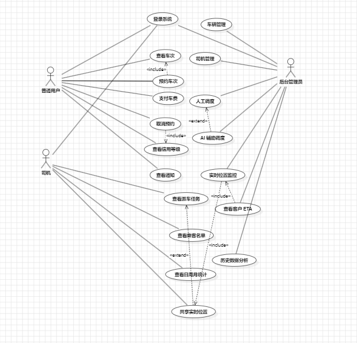

该用例图从全局视角展示了三种参与者（普通用户、司机、后台管理员）与校车管理系统各功能模块之间的关系。

**参与者**：

| Actor | 对应角色 | 说明 |
|-------|----------|------|
| 普通用户 | Passenger | 预约、支付、信用和通知功能 |
| 司机 | Driver | 任务查看、乘客名单、位置共享、统计功能 |
| 后台管理员 | Admin | 车辆管理、司机管理、调度、监控、分析功能 |

**用例清单**：

| 编号 | 用例名称 | 参与者 | 优先级 | 触发条件 |
|------|----------|--------|--------|----------|
| UC-01 | 登录系统 | 全部角色 | 高 | 用户启动应用 |
| UC-02 | 查看车次 | 普通用户 | 高 | 进入乘客首页 |
| UC-03 | 预约车次 | 普通用户 | 高 | 选择可预约车次 |
| UC-04 | 支付车费 | 普通用户 | 高 | 生成待支付订单 |
| UC-05 | 取消预约 | 普通用户 | 高 | 主动取消待发车预约 |
| UC-06 | 查看信用等级 | 普通用户 | 中 | 进入信用面板 |
| UC-07 | 查看通知 | 普通用户 | 中 | 进入通知中心 |
| UC-08 | 查看派车任务 | 司机 | 高 | 进入司机首页 |
| UC-09 | 查看乘客名单 | 司机 | 高 | 点击任务详情 |
| UC-10 | 查看日周月统计 | 司机 | 中 | 进入统计面板 |
| UC-11 | 共享实时位置 | 司机 | 高 | 点击开始任务 |
| UC-12 | 车辆管理 | 管理员 | 高 | 进入后台车辆 TAB |
| UC-13 | 司机管理 | 管理员 | 高 | 进入后台司机 TAB |
| UC-14 | 人工调度 | 管理员 | 高 | 进入调度面板 |
| UC-15 | AI 辅助调度 | 管理员 | 高 | 在调度面板选择 AI 模式 |
| UC-16 | 实时位置监控 | 管理员 | 高 | 进入监控面板 |
| UC-17 | 查看客户 ETA | 管理员 | 高 | 在监控面板点击车辆标记 |
| UC-18 | 历史数据分析 | 管理员 | 中 | 进入分析面板 |

**用例关系**：

| 关系类型 | 源用例 | 目标用例 | 说明 |
|----------|--------|----------|------|
| `<<include>>` | 预约车次 | 查看车次 | 预约前必须先查看车次信息 |
| `<<include>>` | 取消预约 | 查看信用等级 | 取消操作自动触发信用扣分 |
| `<<extend>>` | 共享实时位置 | 查看派车任务 | 发车后可选共享位置 |
| `<<include>>` | 实时位置监控 | 共享实时位置 | 后台监控依赖司机位置上报 |
| `<<include>>` | 查看客户 ETA | 实时位置监控 | ETA 基于实时位置计算 |
| `<<extend>>` | AI 辅助调度 | 人工调度 | AI 是人工调度的智能化扩展 |

### 3.2 用例图 — 乘客端详图

**StarUML 图**：`BUS-FLUTTER-UML.mdj` → `用例图-乘客端`

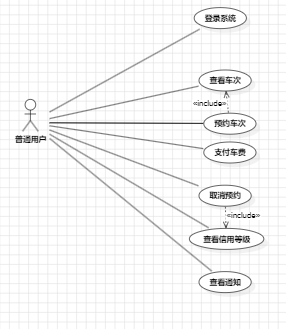

该用例图聚焦普通用户角色，详细展示乘客端的 8 个核心用例。

**用例**：

| 用例 | 说明 |
|------|------|
| 登录系统 | 验证手机号和密码，匹配 APP_MODE 入口 |
| 查看车次列表 | 展示可预约车次（路线、时间、余座、票价） |
| 预约车次 | 选择车次和座位，创建预约订单 |
| 选择座位 | 从可用座位中选择座位号 |
| 支付车费 | 选择微信支付或支付宝完成 Mock 支付 |
| 取消预约 | 取消待发车预约，触发信用扣分 |
| 查看信用等级 | 展示信用分、等级徽章和扣分记录 |
| 查看通知 | 展示预约、支付、取消等系统通知 |

**用例关系**：

| 关系 | 从 | 到 | 说明 |
|------|------|------|------|
| `<<include>>` | 预约车次 | 查看车次列表 | 预约前须查看车次 |
| `<<include>>` | 选择座位 | 预约车次 | 选座是预约一部分 |
| `<<include>>` | 取消预约 | 查看信用等级 | 取消后查看扣分 |
| `<<extend>>` | 支付车费 | 预约车次 | 支付是预约的扩展 |
| `<<extend>>` | 查看通知 | 取消预约 | 取消触发通知 |

---

## 4. 业务需求

| 编号 | 业务需求 | 详细说明 | 关联用例 |
|------|----------|----------|----------|
| BRQ-01 | 提升校车预约效率 | 普通用户在移动端查看车次、预约座位、取消预约和支付车费 | UC-02 ~ UC-05 |
| BRQ-02 | 提升司机任务透明度 | 司机查看派车任务、乘客上车点和日/周/月统计 | UC-08 ~ UC-11 |
| BRQ-03 | 支持调度决策 | 后台进行人工调度和 AI 辅助调度，降低空车/超载风险 | UC-14 ~ UC-15 |
| BRQ-04 | 掌握运行状态 | 后台查看车辆司机 Mock 实时位置、车次状态、客户 ETA | UC-16 ~ UC-17 |
| BRQ-05 | 支持运营复盘 | 后台查看历史数据，分析路线热度、收入和车辆利用率 | UC-18 |
| BRQ-06 | 满足课程交付要求 | 包含计划、需求、设计、源码、测试、配置管理和工具使用证据 | — |

---

## 5. 功能需求

### FR-01 登录和角色入口

```
┌──────────┬──────────────────────────────────────────────────┐
│ 说明     │ 系统支持普通用户、司机、后台管理员三种角色登录         │
│ 输入     │ 手机号、密码、当前入口模式（APP_MODE）               │
│ 处理     │ 校验 Mock 账号密码和角色是否匹配当前入口              │
│ 输出     │ 登录成功 → 对应工作台；失败 → 错误提示               │
│ 源码     │ lib/features/auth/                                │
│          │ lib/core/router/app_router.dart                    │
└──────────┴──────────────────────────────────────────────────┘
```

### FR-02 ~ FR-14 功能需求总表

| 编号 | 功能 | 用户角色 | 输入 | 输出 | 优先级 |
|------|------|----------|------|------|--------|
| FR-01 | 登录和角色入口 | 全部 | 手机号、密码、入口模式 | 对应工作台 / 错误提示 | 高 |
| FR-02 | 预约车次 | 普通用户 | 车次ID、座位号、用户ID | 预约订单（待发车、待支付） | 高 |
| FR-03 | 查看和筛选预约 | 普通用户 | 用户ID、状态筛选 | 预约列表（含车次、座位、费用） | 高 |
| FR-04 | 取消预约和信用扣分 | 普通用户 | 预约ID | 已取消 + 信用扣分记录 | 高 |
| FR-05 | 支付车费 | 普通用户 | 预约ID、支付方式 | Mock 支付流水 + 通知 | 高 |
| FR-06 | 信用等级和通知 | 普通用户 | 信用分、通知列表 | 信用面板 + 通知中心 | 中 |
| FR-07 | 查看派车任务 | 司机 | 司机ID | 车次、路线、乘客名单、上车点 | 高 |
| FR-08 | 任务统计 | 司机 | 统计周期 | 人次、里程、准点率看板 | 中 |
| FR-09 | 实时位置共享 | 司机 | 任务ID | 每5秒Mock位置上报 → 监控端 | 高 |
| FR-10 | 车辆管理 | 管理员 | 车牌号、车型、座位数 | 车辆列表更新 / 错误提示 | 高 |
| FR-11 | 司机管理 | 管理员 | 姓名、手机号、驾照号、绑定车辆 | 司机列表更新 / 错误提示 | 高 |
| FR-12 | 人工和AI调度 | 管理员 | 待调度需求、空闲车辆 | 调度方案（人工/AI生成） | 高 |
| FR-13 | 位置监控和客户ETA | 管理员 | 车辆实时位置 | 地图标记 + 车辆详情 + ETA | 高 |
| FR-14 | 历史数据分析 | 管理员 | 统计周期 | 人次、收入、利用率、路线热度 | 中 |

---

## 6. UML 类图

### 6.1 核心数据模型类图

**StarUML 图**：`BUS-FLUTTER-UML.mdj` → `核心类图`

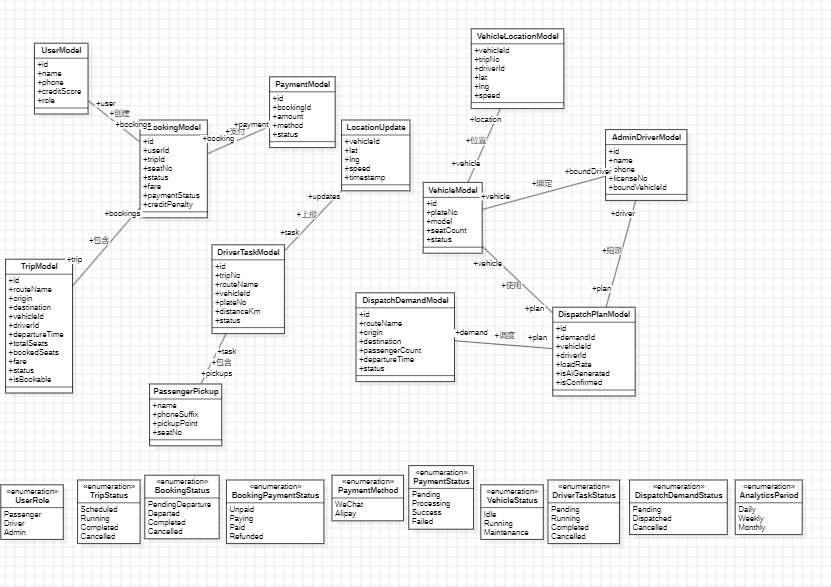

该图展示了 13 个核心数据类及其关联关系。

**核心类说明**：

| 类名 | 源码文件 | 职责 | 关键字段 |
|------|----------|------|----------|
| `UserModel` | `user_model.dart` | 用户身份与信用 | id, name, phone, creditScore, role |
| `TripModel` | `trip_model.dart` | 可预约车次 | id, routeName, origin, destination, departureTime, totalSeats, bookedSeats, fare, status, isBookable |
| `BookingModel` | `booking_model.dart` | 预约订单 | id, userId, tripId, seatNo, status, fare, paymentStatus, creditPenalty |
| `PaymentModel` | `payment_model.dart` | 支付流水 | id, bookingId, amount, method, status |
| `DriverTaskModel` | `driver_task_model.dart` | 司机任务 | id, tripNo, routeName, vehicleId, plateNo, distanceKm, status |
| `PassengerPickup` | `driver_task_model.dart` | 乘客上车点 | name, phoneSuffix, pickupPoint, seatNo |
| `LocationUpdate` | `location_update.dart` | 位置记录 | vehicleId, lat, lng, speed, timestamp |
| `VehicleModel` | `vehicle_model.dart` | 车辆信息 | id, plateNo, model, seatCount, status |
| `AdminDriverModel` | `admin_driver_model.dart` | 司机档案 | id, name, phone, licenseNo, boundVehicleId |
| `DispatchDemandModel` | `dispatch_model.dart` | 预约需求汇总 | id, routeName, origin, destination, passengerCount, departureTime, status |
| `DispatchPlanModel` | `dispatch_model.dart` | 调度方案 | id, demandId, vehicleId, driverId, loadRate, isAiGenerated, isConfirmed |
| `VehicleLocationModel` | `vehicle_location_model.dart` | 实时位置 | vehicleId, tripNo, driverId, lat, lng, speed |
| `AdminAnalyticsSnapshot` | `analytics_model.dart` | 运营分析 | period, totalPassengers, totalRevenue, vehicleUtilization, trend, routeRanking |

**类关系说明**：

```
UserModel (1) ────────── (0..*) BookingModel            用户创建多个预约
TripModel  (1) ────────── (0..*) BookingModel            车次被多次预约
BookingModel (1) ──────── (0..1) PaymentModel            预约对应一笔支付
DriverTaskModel (1) ───── (0..*) PassengerPickup         任务含多个乘客上车点
DriverTaskModel (1) ───── (0..*) LocationUpdate          任务产生多个位置记录
VehicleModel (1) ──────── (0..1) AdminDriverModel        车辆与司机一对一绑定
VehicleModel (1) ──────── (0..1) VehicleLocationModel    车辆对应一个实时位置
DispatchDemandModel (1) ─ (0..1) DispatchPlanModel       需求生成调度方案
DispatchPlanModel (1) ─── (1) VehicleModel               方案使用一辆车
DispatchPlanModel (1) ─── (1) AdminDriverModel           方案指派一位司机
```

### 6.2 枚举与业务类型类图

**StarUML 图**：`BUS-FLUTTER-UML.mdj` → `类图-枚举与业务类型`

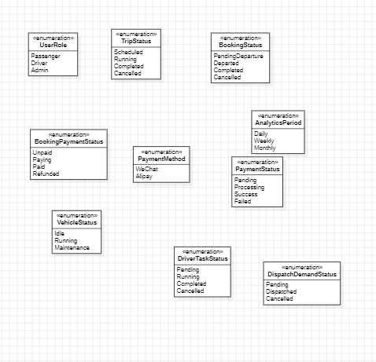

该图展示了系统中 10 个枚举类型。

| 枚举名 | 字面值 | 用途 |
|--------|--------|------|
| `UserRole` | passenger, driver, admin | 用户角色 |
| `TripStatus` | scheduled, running, completed, cancelled | 车次状态 |
| `BookingStatus` | pending, paid, cancelled, completed | 预约状态 |
| `BookingPaymentStatus` | unpaid, paying, paid, refunded | 预约支付状态 |
| `PaymentMethod` | wechat, alipay | 支付方式 |
| `PaymentStatus` | pending, processing, completed, failed | 支付流水状态 |
| `DriverTaskStatus` | pending, running, completed, cancelled | 司机任务状态 |
| `VehicleStatus` | idle, running, maintenance | 车辆状态 |
| `DispatchDemandStatus` | pending, dispatched, cancelled | 调度需求状态 |
| `AnalyticsPeriod` | daily, weekly, monthly | 分析统计周期 |

---

## 7. UML 状态图

系统包含三个状态机，分别描述预约订单、车次和司机任务的生命周期。

**StarUML 图**：`BUS-FLUTTER-UML.mdj`

### 7.1 预约状态机

**图**：`BUS-FLUTTER-UML.mdj` → `预约状态机`

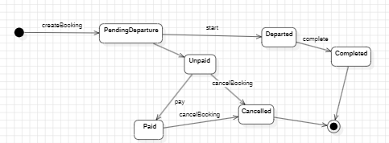

```
[初始] → 待发车 ──┤
                  ├→ 待支付 → 已支付
                  ├→ 已取消 → [终止]
                  └→ 已发车 → 运行中 → 已完成 → [终止]
```

| 状态 | 进入条件 | 退出路径 |
|------|----------|----------|
| 待发车 | 用户创建预约 | 支付、取消、司机发车 |
| 待支付 | 预约创建后默认 | 支付→已支付；取消→已取消 |
| 已支付 | 完成 Mock 支付 | 取消→已取消；发车→已发车 |
| 已发车 | 司机开始任务 | 运行中 |
| 运行中 | 位置上报中 | 到站→已完成 |
| 已完成 | 司机点击到站 | [终止] |
| 已取消 | 用户取消预约 | [终止] |

### 7.2 车次状态机

**图**：`BUS-FLUTTER-UML.mdj` → `车次状态机`

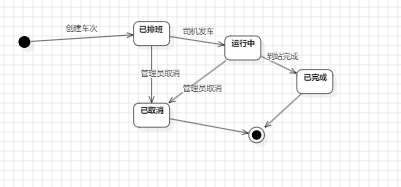

```
[初始] → 已排班 ──┤
                  ├→ 运行中 → 已完成 → [终止]
                  └→ 已取消 → [终止]
```

### 7.3 司机任务状态机

**图**：`BUS-FLUTTER-UML.mdj` → `司机任务状态机`

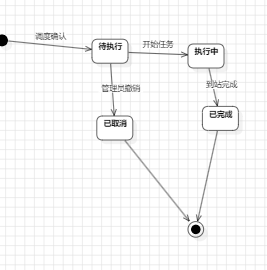

```
[初始] → 待执行 ──┤
                  ├→ 执行中 → 已完成 → [终止]
                  └→ 已取消 → [终止]
```

---

## 8. UML 时序图

### 8.1 时序图 — 司机位置上报

**StarUML 图**：`BUS-FLUTTER-UML.mdj` → `时序图-司机位置上报`

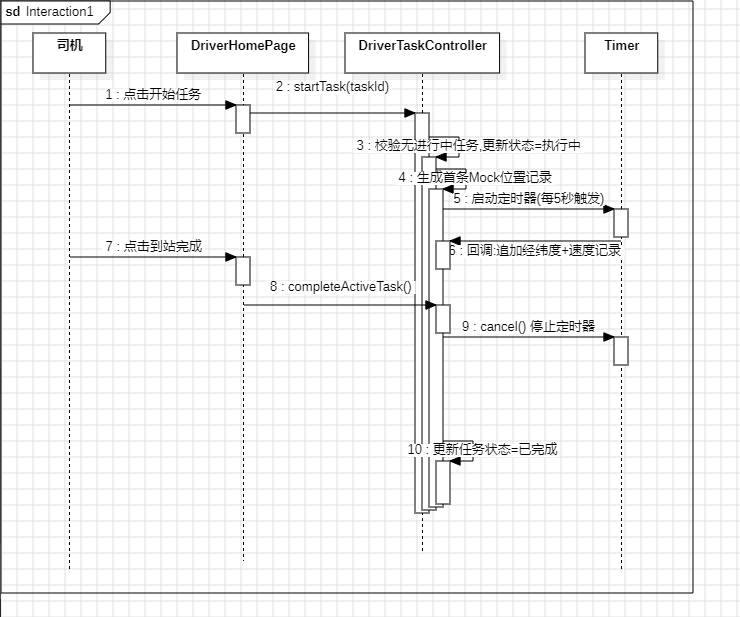

**参与者**：司机（Actor）、DriverHomePage、DriverTaskController、Timer

**交互步骤**：

| 步骤 | 从 | 到 | 动作 |
|------|------|------|------|
| 1 | 司机 | DriverHomePage | 点击开始任务 |
| 2 | DriverHomePage | DriverTaskController | `startTask(taskId)` |
| 3 | DriverTaskController | DriverTaskController | 校验无进行中任务，更新状态=执行中 |
| 4 | DriverTaskController | DriverTaskController | 生成首条Mock位置记录 |
| 5 | DriverTaskController | Timer | 启动定时器(每5秒触发) |
| 6 | Timer | DriverTaskController | 回调:追加经纬度+速度记录 |
| 7 | 司机 | DriverHomePage | 点击到站完成 |
| 8 | DriverHomePage | DriverTaskController | `completeActiveTask()` |
| 9 | DriverTaskController | Timer | `cancel()` 停止定时器 |
| 10 | DriverTaskController | DriverTaskController | 更新任务状态=已完成 |

### 8.2 时序图 — 乘客预约支付

**StarUML 图**：`BUS-FLUTTER-UML.mdj` → `时序图-乘客预约支付`

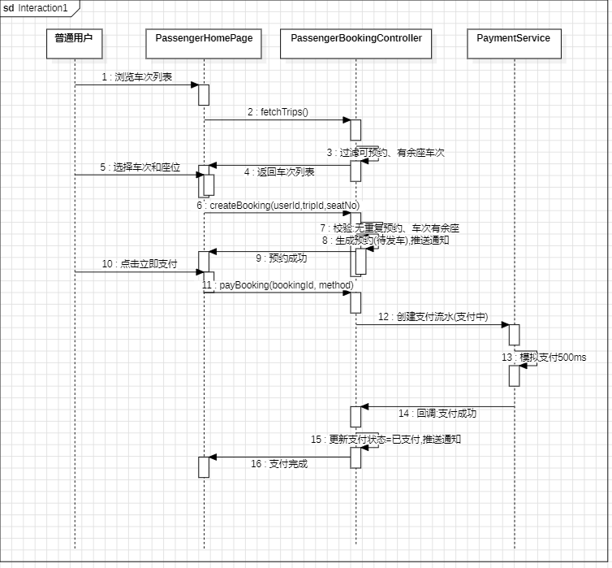

**参与者**：普通用户（Actor）、PassengerHomePage、PassengerBookingController、PaymentService

**交互步骤**：

| 步骤 | 从 | 到 | 动作 |
|------|------|------|------|
| 1 | 普通用户 | PassengerHomePage | 浏览车次列表 |
| 2 | PassengerHomePage | PassengerBookingController | `fetchTrips()` |
| 3 | PassengerBookingController | PassengerBookingController | 过滤可预约、有余座车次 |
| 4 | PassengerBookingController | PassengerHomePage | 返回车次列表 |
| 5 | 普通用户 | PassengerHomePage | 选择车次和座位 |
| 6 | PassengerHomePage | PassengerBookingController | `createBooking(userId,tripId,seatNo)` |
| 7 | PassengerBookingController | PassengerBookingController | 校验:无重复预约、车次有余座 |
| 8 | PassengerBookingController | PassengerBookingController | 生成预约(待发车),推送通知 |
| 9 | PassengerBookingController | PassengerHomePage | 预约成功 |
| 10 | 普通用户 | PassengerHomePage | 点击立即支付 |
| 11 | PassengerHomePage | PassengerBookingController | `payBooking(bookingId, method)` |
| 12 | PassengerBookingController | PaymentService | 创建支付流水(支付中) |
| 13 | PaymentService | PaymentService | 模拟支付500ms |
| 14 | PaymentService | PassengerBookingController | 回调:支付成功 |
| 15 | PassengerBookingController | PassengerBookingController | 更新支付状态=已支付,推送通知 |
| 16 | PassengerBookingController | PassengerHomePage | 支付完成 |

---

## 9. UML 部署图

**StarUML 图**：`BUS-FLUTTER-UML.mdj` → `部署图`

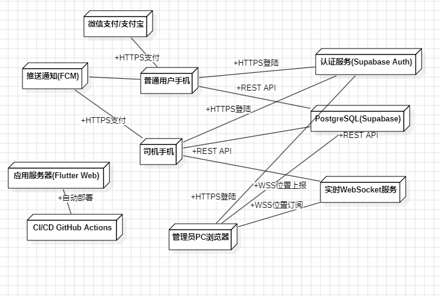

该图描述校车管理系统的物理部署拓扑。

### 节点清单（10个）

| 节点 | 类型 | 说明 |
|------|------|------|
| 普通用户手机 | 移动设备 | Flutter App（Passenger Mode） |
| 司机手机 | 移动设备 | Flutter App（Driver Mode） |
| 管理员PC浏览器 | 桌面设备 | Flutter Web（Admin Mode） |
| 应用服务器(Flutter Web) | 云服务器 | 托管 Admin Web 构建产物 |
| PostgreSQL(Supabase) | 云数据库 | 存储所有业务数据 |
| 认证服务(Supabase Auth) | 云服务 | 用户认证和授权 |
| 实时WebSocket服务 | 云服务 | 司机位置实时推送 |
| CI/CD GitHub Actions | CI/CD | 自动构建、测试和部署 |
| 微信支付/支付宝 | 第三方服务 | Mock 支付网关 |
| 推送通知(FCM) | 第三方服务 | 消息推送通知 |

### 通信路径（12条）

| 源节点 | 目标节点 | 协议 | 说明 |
|--------|----------|------|------|
| 普通用户手机 | 认证服务 | HTTPS | 登录认证 |
| 司机手机 | 认证服务 | HTTPS | 登录认证 |
| 管理员PC浏览器 | 认证服务 | HTTPS | 登录认证 |
| 普通用户手机 | PostgreSQL | REST | 预约/支付/查询 |
| 司机手机 | PostgreSQL | REST | 任务/上报位置 |
| 管理员PC浏览器 | PostgreSQL | REST | CRUD/调度/分析 |
| 司机手机 | 实时WebSocket | WSS | 位置上报 |
| 管理员PC浏览器 | 实时WebSocket | WSS | 位置订阅 |
| 普通用户手机 | 微信支付/支付宝 | HTTPS | Mock 支付 |
| 普通用户手机 | 推送通知 | — | 消息推送 |
| 司机手机 | 推送通知 | — | 消息推送 |
| CI/CD | 应用服务器 | — | 自动部署 |

---

## 10. UML 组件图

### 10.1 组件图 — 前端架构

**StarUML 图**：`BUS-FLUTTER-UML.mdj` → `组件图-前端架构`

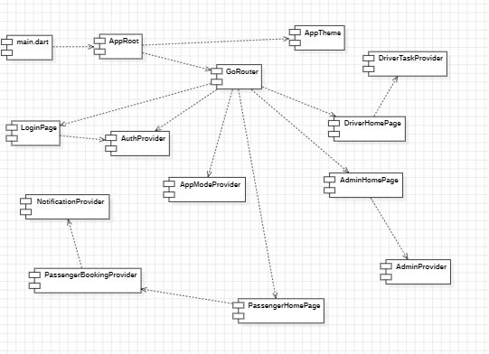

**组件清单（14个）**：

| 组件 | 层 | 职责 |
|------|------|------|
| `main.dart` | 入口 | 读取 APP_MODE，初始化 ProviderScope |
| `AppRoot` | 入口 | 构建 MaterialApp.router |
| `GoRouter` | 路由 | 登录鉴权和角色重定向 |
| `AppTheme` | 主题 | 三端视觉主题 |
| `LoginPage` | 认证 | 登录界面 |
| `AuthProvider` | 状态 | 登录态管理 |
| `AppModeProvider` | 状态 | 端入口切换 |
| `PassengerHomePage` | 乘客 | 预约/支付/信用/通知面板 |
| `PassengerBookingProvider` | 乘客 | 预约和支付状态 |
| `NotificationProvider` | 共享 | 通知管理 |
| `DriverHomePage` | 司机 | 任务列表/统计/位置面板 |
| `DriverTaskProvider` | 司机 | 任务和位置上报状态 |
| `AdminHomePage` | 后台 | 车辆/司机/调度/监控/分析 |
| `AdminProvider` | 后台 | 管理端全部状态 |

**依赖关系（14条）**：

```
main.dart → AppRoot → GoRouter
                   → AppTheme
GoRouter → LoginPage → AuthProvider
         → AppModeProvider
         → AuthProvider
         → PassengerHomePage → PassengerBookingProvider → NotificationProvider
         → DriverHomePage → DriverTaskProvider
         → AdminHomePage → AdminProvider
```

### 10.2 组件图 — 数据层与后端

**StarUML 图**：`BUS-FLUTTER-UML.mdj` → `组件图-数据层与后端`

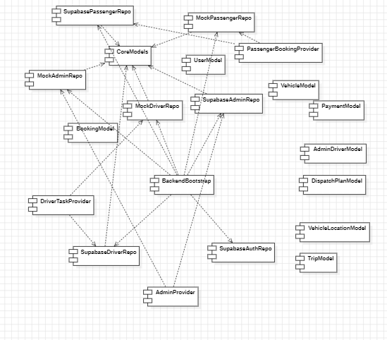

**组件清单（20个）**：

| 组件 | 类别 | 职责 |
|------|------|------|
| `CoreModels` | 数据模型包 | 聚合 9 个业务模型 |
| `UserModel` ~ `VehicleLocationModel` (8个) | 数据模型 | 业务数据结构 |
| `PassengerBookingProvider` | 乘客 Provider | 预约业务逻辑 |
| `DriverTaskProvider` | 司机 Provider | 任务业务逻辑 |
| `AdminProvider` | 后台 Provider | 管理业务逻辑 |
| `MockPassengerRepo` | Mock 仓库 | 乘客端内存数据 |
| `MockDriverRepo` | Mock 仓库 | 司机端内存数据 |
| `MockAdminRepo` | Mock 仓库 | 后台端内存数据 |
| `SupabasePassengerRepo` | Supabase 仓库 | 乘客端远程数据 |
| `SupabaseDriverRepo` | Supabase 仓库 | 司机端远程数据 |
| `SupabaseAdminRepo` | Supabase 仓库 | 后台端远程数据 |
| `SupabaseAuthRepo` | Supabase 仓库 | 认证远程服务 |
| `BackendBootstrap` | 后端引导 | Mock/Supabase 初始化切换 |

**依赖关系（19条）**：所有 Repository 依赖 CoreModels；Provider 同时依赖 Mock 和 Supabase 两套 Repository；BackendBootstrap 管理全部 Repository 初始化。

---

## 11. 非功能需求

| 编号 | 类别 | 需求描述 | 验证方式 |
|------|------|----------|----------|
| NFR-01 | 易用性 | 三端工作台卡片式布局，核心操作按钮明确 | 手工测试 + Widget 测试 |
| NFR-02 | 可维护性 | `core`/`features`/`shared` 分层，Provider 中放业务逻辑 | 源码检查 |
| NFR-03 | 可测试性 | 关键流程有 Widget 自动化测试和业务规则测试 | `flutter test` |
| NFR-04 | 可扩展性 | Mock Repository 可替换为真实后端服务 | 设计审查 |
| NFR-05 | 响应式 | 使用 LayoutBuilder 适配不同屏幕 | 多尺寸测试 |
| NFR-06 | 性能 | 位置上报 5 秒，Mock 支付 ≤ 500ms | 代码审查 |
| NFR-07 | 安全 | 课程原型不含敏感数据，正式版需加密和权限 | 文档说明 |

---

## 12. 业务规则

| 编号 | 规则 | 触发场景 | 后果 |
|------|------|----------|------|
| RUL-01 | 用户只能登录与入口一致的角色 | 登录校验 | 提示错误 |
| RUL-02 | 只有待发车且未过时间的车次可预约 | 预约校验 | 提示不可预约 |
| RUL-03 | 同一用户不能重复预约同一车次 | 预约去重 | 提示已预约 |
| RUL-04 | 只有待发车状态的预约可以取消 | 取消校验 | 提示不可取消 |
| RUL-05 | 距发车≤2h取消扣5分，>2h扣2分 | 取消扣分 | 信用分减少 |
| RUL-06 | 只有待支付的预约可以支付 | 支付校验 | 提示不可支付 |
| RUL-07 | 运行中车辆不可删除 | 车辆删除 | 提示先完成任务 |
| RUL-08 | 在途司机不可删除 | 司机删除 | 提示有进行中任务 |
| RUL-09 | 车辆与司机保持一对一绑定 | 司机绑定 | 提示已绑定 |
| RUL-10 | 调度车辆必须空闲，座位数≥人数 | 调度校验 | 拒绝生成方案 |
| RUL-11 | AI调度只选空闲且已绑定司机的车辆 | AI 调度 | 返回失败提示 |

---

## 13. 数据字典

| 数据对象 | 源码文件 | 关键字段 |
|----------|----------|----------|
| User | `user_model.dart` | id, name, phone, creditScore, role |
| Trip | `trip_model.dart` | id, routeName, origin, destination, departureTime, totalSeats, bookedSeats, fare, status |
| Booking | `booking_model.dart` | id, userId, tripId, seatNo, status, paymentStatus, creditPenalty |
| Payment | `payment_model.dart` | id, bookingId, amount, method, status |
| DriverTask | `driver_task_model.dart` | id, tripNo, routeName, vehicleId, plateNo, distanceKm, status |
| PassengerPickup | `driver_task_model.dart` | name, phoneSuffix, pickupPoint, seatNo |
| LocationUpdate | `location_update.dart` | vehicleId, lat, lng, speed, timestamp |
| Vehicle | `vehicle_model.dart` | id, plateNo, model, seatCount, status |
| Driver | `admin_driver_model.dart` | id, name, phone, licenseNo, boundVehicleId |
| DispatchDemand | `dispatch_model.dart` | id, routeName, origin, destination, passengerCount, departureTime, status |
| DispatchPlan | `dispatch_model.dart` | id, demandId, vehicleId, driverId, loadRate, isAiGenerated, isConfirmed |
| VehicleLocation | `vehicle_location_model.dart` | vehicleId, tripNo, driverId, lat, lng, speed |
| Analytics | `analytics_model.dart` | period, totalPassengers, totalRevenue, vehicleUtilization, trend, routeRanking |

---

## 14. 需求追踪矩阵

| 需求编号 | 需求简述 | 设计模块 | 源码路径 | 测试用例 |
|----------|----------|----------|----------|----------|
| FR-01 | 登录和角色入口 | 入口和路由设计 | `lib/features/auth/`, `app_router.dart` | TC-01, TC-05, TC-18 |
| FR-02 | 预约车次 | 乘客端设计 | `lib/features/passenger/booking/` | TC-02, TC-19 |
| FR-03 | 查看筛选预约 | 乘客端设计 | `passenger_home_page.dart` | TC-01 |
| FR-04 | 取消预约信用扣分 | 取消规则设计 | `passenger_booking_provider.dart` | TC-03, TC-20 |
| FR-05 | 支付车费 | Mock支付流程 | `payment_model.dart` | TC-04 |
| FR-06 | 信用等级和通知 | 通知设计 | `notification_provider.dart` | TC-03, TC-04 |
| FR-07 | 司机查看任务 | 司机任务模块 | `driver_home_page.dart` | TC-05 |
| FR-08 | 司机任务统计 | 统计看板模块 | `driver_task_provider.dart` | TC-05 |
| FR-09 | 实时位置共享 | 位置共享模块 | `location_update.dart` | TC-06 ~ TC-08 |
| FR-10 | 车辆管理 | 车辆管理模块 | `admin_provider.dart` | TC-09, TC-10, TC-21 |
| FR-11 | 司机管理 | 司机管理模块 | `admin_driver_model.dart` | TC-11, TC-22 |
| FR-12 | 人工和AI调度 | 调度模块 | `dispatch_model.dart` | TC-12, TC-13, TC-23, TC-24 |
| FR-13 | 位置监控和ETA | 监控模块 | `vehicle_location_model.dart` | TC-14 ~ TC-16 |
| FR-14 | 历史数据分析 | 分析模块 | `analytics_model.dart` | TC-17 |

---

## 15. 验收标准

| 编号 | 验收项 | 验收方式 | 通过条件 |
|------|--------|----------|----------|
| AC-01 | 普通用户主流程 | 自动化测试 + 手工演示 | 登录→浏览→预约→支付→取消 全流程走通 |
| AC-02 | 司机任务流程 | 自动化测试 + 手工演示 | 登录→查看任务→开始任务→位置上报→完成任务 |
| AC-03 | 管理员调度流程 | 自动化测试 + 手工演示 | 维护车辆司机→生成调度方案→确认生效 |
| AC-04 | 实时监控功能 | 自动化测试 + 手工演示 | 查看车辆位置、司机详情、客户ETA |
| AC-05 | 历史数据分析 | 自动化测试 + 手工演示 | 日/周/月数据切换和图表展示 |
| AC-06 | UML 建模完整性 | 文件检查 | 用例图x2、类图x2、状态图x1、时序图x2、部署图x1、组件图x2 共 10 张图 |
| AC-07 | 文档完整性 | 文件检查 | 计划、需求、设计、源码、测试、配置管理、最终报告七份齐全 |
| AC-08 | 工具标识规范 | 文件检查 | 每份报告含课程工具标识和证据路径 |

---

## 16. UML 图片导出指南

### StarUML 导出步骤

1. 打开 `docs/uml/BUS-FLUTTER-UML.mdj`
2. 在左侧树中选择要导出的图
3. **File → Export Diagram → PNG (*.png)**
4. 保存到 `docs/uml/images/` 目录
5. 按以下命名保存：

| 图 | 导出文件名 |
|------|------|
| 用例图 | `usecase_overview.png` |
| 用例图-乘客端 | `usecase_passenger.png` |
| 核心类图 | `class_core.png` |
| 类图-枚举与业务类型 | `class_enums.png` |
| 预约状态机 | `state_booking.png` |
| 车次状态机 | `state_trip.png` |
| 司机任务状态机 | `state_drivertask.png` |
| 时序图-司机位置上报 | `sequence_driver.png` |
| 时序图-乘客预约支付 | `sequence_passenger.png` |
| 部署图 | `deployment.png` |
| 组件图-前端架构 | `component_frontend.png` |
| 组件图-数据层与后端 | `component_backend.png` |

### 批量导出（推荐）

如果 StarUML 支持 **File → Export All Diagrams**，选择 PNG 格式，统一导出到 `docs/uml/images/`。

### 粘贴到文档

图片导出后，文档中的 `` 占位符会自动加载图片。用 Typora、VS Code 或任何 Markdown 编辑器打开本文档即可看到完整的图文报告。

---

> **文档版本**：v2.0  
> **生成日期**：2026-06-14  
> **UML 源文件**：`docs/uml/BUS-FLUTTER-UML.mdj`（StarUML 原生格式）  
> **UML 图导出**：`docs/uml/images/`（12 张 PNG）  
> **工具链**：StarUML (UML建模) + Markdown (文档编写) + Git (版本管理)
