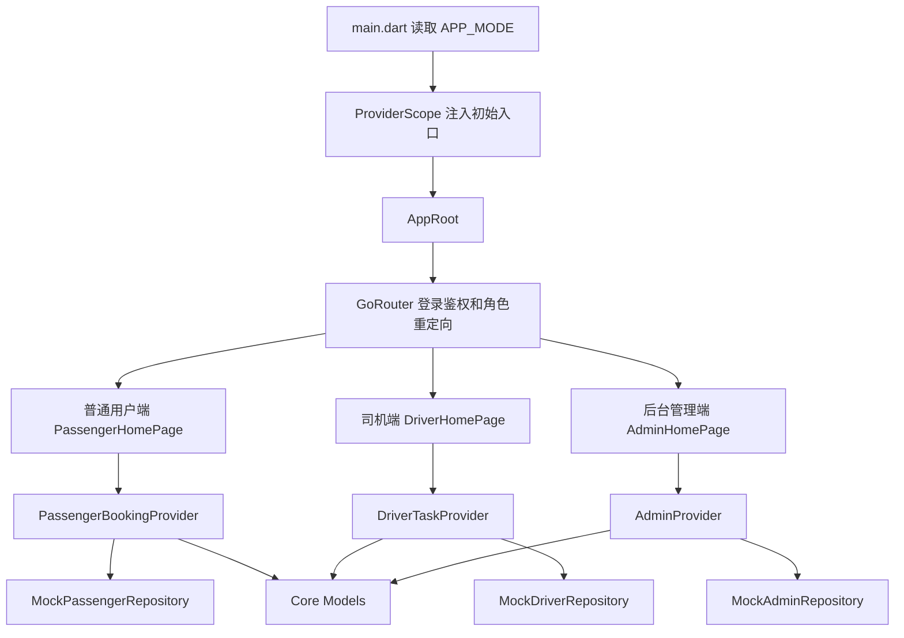

# 项目设计

## 课程工具标识

`[课程工具标识: UML/PlantUML + Mermaid + 架构设计文档]` 本部分使用 UML 组件图、类图、顺序图和活动图描述系统设计，PlantUML 源文件位于 `docs/uml/component_diagram.puml`、`docs/uml/class_diagram.puml`、`docs/uml/driver_location_sequence.puml` 和 `docs/uml/dispatch_activity.puml`。本文档同时使用 Mermaid 描述总体架构数据流，满足课程设计图文结合要求。

## 设计目标

| 目标 | 说明 |
| --- | --- |
| 三端复用 | 普通用户端、司机端和后台端共用 Flutter 工程、主题、路由、模型和状态管理能力 |
| 原型可运行 | 在没有真实支付、真实 GPS 和真实地图 SDK 的情况下，通过 Mock Repository 完成功能闭环 |
| 模块清晰 | 按 `core`、`features`、`shared` 拆分代码，降低功能之间耦合 |
| 易测试 | 将核心业务逻辑放入 Riverpod Provider，页面通过 Widget Test 验证关键流程，边界规则通过业务规则测试验证 |
| 可扩展 | Mock 数据层可替换为 REST API、WebSocket、真实支付和地图 SDK |
| 可交付 | 设计说明和 `lib/`、`test/` 真实路径一致，便于课程检查 |

## 概要设计

系统采用 Flutter 单工程多入口架构。`lib/main.dart` 读取 `APP_MODE` 环境变量，初始化普通用户端、司机端或后台管理端入口。三端共享 `AppRoot`、`GoRouter`、主题、用户模型和业务模型，不同端的页面和业务逻辑放在 `features` 目录下。

核心思想为：表现层只处理界面和交互；业务状态和规则集中在 Riverpod Provider；Mock Repository 提供初始数据；Core Models 定义跨端共享数据结构。这样既保留课程原型的简单性，也让后续替换真实后端、支付和地图服务时有明确扩展边界。



## 系统结构设计

| 层级 | 技术或目录 | 职责 |
| --- | --- | --- |
| 应用入口层 | `lib/main.dart`、`lib/app.dart` | 初始化 ProviderScope、主题和路由 |
| 路由鉴权层 | `lib/core/router/` | 使用 GoRouter 根据登录态和角色控制访问 |
| 表现层 | `features/*/presentation` | 页面布局、弹窗、表单和用户交互 |
| 状态层 | `features/*/providers`、`core/providers` | 登录态、入口模式、预约状态、司机任务、后台管理状态 |
| 数据层 | `features/*/data` | Mock 数据仓库和 Supabase 可切换仓库骨架 |
| 模型层 | `core/models` | 用户、车次、预约、支付、车辆、司机、调度、位置、分析数据模型 |
| 共享层 | `shared/widgets` | 三端共用入口切换和卡片组件 |

## 目录设计

```text
lib/
├── main.dart
├── app.dart
├── core/
│   ├── config/
│   ├── models/
│   ├── providers/
│   ├── router/
│   ├── services/
│   └── theme/
├── features/
│   ├── auth/
│   ├── passenger/
│   ├── driver/
│   └── admin/
└── shared/
    └── widgets/
```

## 模块划分

| 模块 | 主要文件 | 设计职责 |
| --- | --- | --- |
| 应用入口模块 | `lib/main.dart`、`lib/app.dart` | 读取入口模式、初始化 ProviderScope、构建 `MaterialApp.router` |
| 登录模块 | `lib/features/auth/`、`lib/core/providers/auth_provider.dart` | Mock 账号校验、登录态管理、角色入口匹配 |
| 普通用户模块 | `lib/features/passenger/` | 车次展示、预约、取消、支付、信用和通知 |
| 司机模块 | `lib/features/driver/` | 派车任务、任务统计、Mock 位置上报和任务完成 |
| 后台模块 | `lib/features/admin/` | 车辆管理、司机管理、调度、监控、ETA 和分析 |
| 公共模型模块 | `lib/core/models/` | 定义三端共享数据结构 |
| 通知模块 | `lib/core/providers/notification_provider.dart` | 预约、支付、取消等 Mock 通知 |
| 路由模块 | `lib/core/router/` | 登录页和三端首页的访问控制 |

## 入口和路由设计

| 文件 | 设计说明 |
| --- | --- |
| `lib/main.dart` | 读取 `APP_MODE`，通过 `ProviderScope` 注入初始入口模式 |
| `lib/app.dart` | 构建 `MaterialApp.router`，应用主题和路由配置 |
| `lib/core/router/app_router.dart` | 根据登录状态和角色重定向，禁止跨角色访问其它端页面 |
| `lib/core/models/app_mode.dart` | 定义 `passenger`、`driver`、`admin` 三种入口及首页路径 |

路由策略为：未登录或角色不匹配时重定向到 `/login`；登录成功后进入当前模式对应首页；如果用户直接访问其它端路径，系统自动重定向到当前角色首页。

## 详细设计

### 普通用户端设计

| 子模块 | 设计 | 源码对应 |
| --- | --- | --- |
| 车次列表 | 从 `PassengerBookingState.trips` 读取车次，过滤可预约和有余座车次 | `passenger_home_page.dart` |
| 预约座位 | 弹窗展示可用座位，提交时校验车次状态、余座、重复预约和座位占用 | `PassengerBookingController.createBooking` |
| 我的预约 | 支持按预约状态筛选，展示座位、费用、车次和支付状态 | `PassengerBookingState.bookingsForUser` |
| 支付 | 选择微信支付或支付宝，生成 `PaymentModel`，模拟支付中到已支付状态 | `PassengerBookingController.payBooking` |
| 信用 | 取消预约时调用 `adjustCreditScore` 扣分，信用面板展示等级和扣分记录 | `AuthController.adjustCreditScore`、`_CreditPanel` |
| 通知 | 预约、支付、取消扣分产生 `AppNotificationModel`，页面展示未读数量和通知中心 | `notification_provider.dart` |

### 司机端设计

| 子模块 | 设计 | 源码对应 |
| --- | --- | --- |
| 派车任务 | `DriverTaskModel` 包含车次号、路线、车辆、距离、状态和乘客上车点 | `driver_home_page.dart`、`driver_task_model.dart` |
| 统计看板 | `DriverStats` 按日、周、月存储完成车次、服务人次、行驶里程和准点率 | `_StatsPanel`、`selectStatsPeriod` |
| 实时位置 | 开始任务后状态变为运行中，`Timer.periodic` 每 5 秒追加 `LocationUpdate` | `DriverTaskController.startTask` |
| 到站完成 | 停止 Timer，任务状态变为已完成，位置共享状态变为未开启 | `completeActiveTask` |

### 后台管理端设计

| 子模块 | 设计 | 源码对应 |
| --- | --- | --- |
| 车辆管理 | 支持新增、编辑、删除车辆；运行中车辆不可删除 | `AdminController.addVehicle`、`updateVehicle`、`deleteVehicle` |
| 司机管理 | 支持新增、编辑、删除司机；车辆绑定保持一车一司机；在途司机不可删除 | `AdminController.addDriver`、`updateDriver`、`deleteDriver` |
| 预约需求汇总 | `DispatchDemandModel` 聚合路线、人数和发车时间 | `MockAdminRepository.fetchDispatchDemands` |
| 人工调度 | 管理员手动选择空闲车辆和司机，系统校验座位数和绑定关系 | `createManualDispatchPlan`、`_ManualDispatchDialog` |
| AI 辅助调度 | 按预约人数降序遍历需求，匹配空闲且已绑定司机的车辆生成推荐方案 | `generateAiDispatchPlans` |
| 调度确认 | 需求改为已调度，车辆改为运行中，司机绑定车辆，生成位置记录 | `confirmDispatchPlan` |
| 实时监控 | Mock 地图展示在途车辆标记，点击后展示车次、司机、速度、坐标和更新时间 | `_TrackingPanel`、`_MockMap` |
| 客户 ETA | 展示预约客户上车点、距离和预计到达时间 | `_PassengerEtaPanel` |
| 历史分析 | 按日、周、月展示人次、收入、车辆利用率、趋势图和路线热度排行 | `_AnalyticsPanel`、`AdminAnalyticsSnapshot` |

## 接口设计

当前系统为课程原型，接口主要表现为 Repository 和 Provider 方法，不暴露真实 HTTP API。接口边界如下：

| 接口类型 | 方法或类 | 输入 | 输出 | 说明 |
| --- | --- | --- | --- | --- |
| 登录接口 | `AuthRepository.login` | `phone`、`password`、`mode` | `UserModel` 或 `AuthException` | Mock 登录和角色入口校验 |
| 预约接口 | `PassengerBookingController.createBooking` | `userId`、`tripId`、`seatNo` | `BookingActionResult` | 预约车次并创建通知 |
| 取消接口 | `PassengerBookingController.cancelBooking` | `bookingId` | `BookingActionResult` | 校验预约状态、扣减信用分 |
| 支付接口 | `PassengerBookingController.payBooking` | `bookingId`、`PaymentMethod` | `BookingActionResult` | Mock 支付中到已支付 |
| 司机任务接口 | `DriverTaskController.startTask` | `taskId` | 状态更新 | 开始任务并共享 Mock 位置 |
| 车辆接口 | `AdminController.addVehicle/updateVehicle/deleteVehicle` | 车辆字段或车辆 ID | `AdminActionResult` | 管理车辆并执行业务校验 |
| 司机接口 | `AdminController.addDriver/updateDriver/deleteDriver` | 司机字段或司机 ID | `AdminActionResult` | 管理司机和车辆绑定 |
| 调度接口 | `createManualDispatchPlan`、`generateAiDispatchPlans`、`confirmDispatchPlan` | 需求、车辆、司机或方案 ID | `AdminActionResult` | 生成和确认调度方案 |
| 位置接口 | `simulateLocationTick` | 无 | 状态更新 | 模拟后台车辆位置刷新 |
| 分析接口 | `selectAnalyticsPeriod` | `AnalyticsPeriod` | 状态更新 | 切换日、周、月统计 |

## 数据设计

| 模型 | 关键字段 | 用途 | 源码 |
| --- | --- | --- | --- |
| `UserModel` | `id`、`name`、`phone`、`creditScore`、`role` | 登录用户和信用信息 | `lib/core/models/user_model.dart` |
| `TripModel` | `routeName`、`origin`、`destination`、`departureTime`、`totalSeats`、`bookedSeats`、`fare`、`status` | 普通用户可预约车次 | `lib/core/models/trip_model.dart` |
| `BookingModel` | `userId`、`tripId`、`seatNo`、`status`、`paymentStatus`、`creditPenalty` | 预约订单 | `lib/core/models/booking_model.dart` |
| `PaymentModel` | `bookingId`、`amount`、`method`、`status` | Mock 支付流水 | `lib/core/models/payment_model.dart` |
| `DriverTaskModel` | `tripNo`、`routeName`、`vehicleId`、`passengers`、`distanceKm`、`status` | 司机派车任务 | `lib/core/models/driver_task_model.dart` |
| `LocationUpdate` | `vehicleId`、`lat`、`lng`、`speed`、`timestamp` | 司机端位置上报 | `lib/core/models/location_update.dart` |
| `VehicleModel` | `plateNo`、`model`、`seatCount`、`status` | 后台车辆管理 | `lib/core/models/vehicle_model.dart` |
| `AdminDriverModel` | `name`、`phone`、`licenseNo`、`boundVehicleId` | 后台司机管理 | `lib/core/models/admin_driver_model.dart` |
| `DispatchDemandModel` | `routeName`、`passengerCount`、`departureTime`、`status` | 预约需求汇总 | `lib/core/models/dispatch_model.dart` |
| `DispatchPlanModel` | `vehicleId`、`driverId`、`loadRate`、`isAiGenerated`、`isConfirmed` | 调度方案 | `lib/core/models/dispatch_model.dart` |
| `VehicleLocationModel` | `vehicleId`、`tripNo`、`driverId`、`lat`、`lng`、`speed` | 后台 Mock 实时位置 | `lib/core/models/vehicle_location_model.dart` |
| `AdminAnalyticsSnapshot` | `totalPassengers`、`totalRevenue`、`vehicleUtilization`、`trend`、`routeRanking` | 历史数据分析 | `lib/core/models/analytics_model.dart` |

## 状态管理设计

| Provider | 类型 | 状态内容 | 主要操作 |
| --- | --- | --- | --- |
| `appModeControllerProvider` | Riverpod Provider | 当前端入口 | 切换普通用户、司机、后台入口 |
| `authControllerProvider` | Riverpod Notifier | 登录用户、加载状态、错误信息 | 登录、退出、调整信用分 |
| `notificationProvider` | Riverpod Notifier | 通知列表 | 推送通知、全部已读 |
| `passengerBookingProvider` | Riverpod Notifier | 车次、预约、支付流水 | 预约、取消、支付 |
| `driverTaskProvider` | Riverpod Notifier | 司机任务、统计、位置上报 | 开始任务、上报位置、完成任务、切换统计周期 |
| `adminProvider` | Riverpod Notifier | 车辆、司机、位置、调度、分析 | CRUD、调度、确认、位置刷新、统计切换 |

## AI 调度算法设计

当前 AI 辅助调度采用规则引擎模拟。算法目标是在课程原型中提供可解释、可演示的自动推荐能力，不调用真实 AI 服务。

算法步骤：

1. 获取所有空闲车辆。
2. 过滤出已经绑定司机的车辆，形成车辆司机候选对。
3. 获取待调度需求，并按 `passengerCount` 从大到小排序。
4. 对每个需求选择第一辆未使用且座位数满足人数的车辆。
5. 生成 `DispatchPlanModel`，标记 `isAiGenerated=true`。
6. 若无候选车辆或座位数无法覆盖需求，返回失败提示。
7. 管理员确认后方案生效，车辆状态改为运行中。

复杂度分析：需求数为 `n`、候选车辆数为 `m`，当前实现近似为 `O(n*m)`，对课程原型和校园车队规模足够。

## 实时位置设计

| 端 | 设计 |
| --- | --- |
| 司机端 | 发车后立即生成一次位置记录，并每 5 秒追加一次 Mock 经纬度和速度 |
| 后台端 | 初始化时读取运行中车辆位置，每 5 秒模拟刷新运行中车辆坐标 |
| 地图显示 | 使用 Flutter `Stack` 和 `CustomPaint` 绘制 Mock 地图网格和车辆标记 |
| 扩展方案 | 正式版本可将 `Timer.periodic` 替换为 GPS 采集和 WebSocket 上报订阅 |

## 高内聚低耦合设计说明

| 设计原则 | 项目体现 |
| --- | --- |
| 高内聚 | 普通用户、司机、后台分别放在 `features/passenger`、`features/driver`、`features/admin` 中，每个模块只处理本端业务 |
| 低耦合 | 三端通过 `core/models` 共享数据结构，通过 Provider 暴露状态，页面不直接访问其它端内部实现 |
| 信息隐藏 | Mock 数据初始化封装在 Repository 中，页面只使用 Provider 暴露的状态和操作结果 |
| 模块独立性 | 登录、预约、司机任务、后台管理、通知等模块可单独测试或替换 |
| 可扩展性 | Supabase 仓库和 Mock 仓库共用业务模型，后续可逐步替换数据来源 |

## 异常处理和校验设计

| 场景 | 处理 | 测试证据 |
| --- | --- | --- |
| 登录手机号为空 | 表单提示请输入手机号 | Widget 手工验证 |
| 登录角色不匹配 | 提示当前入口不匹配 | `TC-18` |
| 重复预约 | 阻止提交并提示不能重复预约 | `TC-19` |
| 车次已满座 | 阻止预约并提示已满座 | 手工测试 |
| 已完成或已取消预约取消 | 阻止取消并提示只有待发车预约可以取消 | `TC-20` |
| 运行中车辆删除 | 阻止删除并提示运行中车辆不可删除 | `TC-21` |
| 司机绑定冲突 | 阻止保存并提示车辆已绑定其他司机 | `TC-22` |
| 座位数不足调度 | 阻止人工调度并提示车辆座位数不足 | `TC-23` |
| 无可调度车辆 | AI 调度返回失败提示 | `TC-24` |
| Supabase 不可用 | 保持 Mock fallback 状态可见 | 源码注释和手工检查 |

## UI 设计

系统使用 Material 组件构建工作台式界面。三端首页顶部为摘要卡片，中部为功能面板，底部为列表或图表。后台端在宽屏下采用左右分栏，在窄屏下改为上下排列。主题通过 `AppTheme.light(mode)` 根据端类型提供一致但可区分的视觉风格。

## 可扩展接口设计

| 当前 Mock 模块 | 正式版本替换方向 | 当前边界说明 |
| --- | --- | --- |
| `MockAuthRepository` | REST 登录接口、Token 和安全存储 | 当前只校验 Mock 账号 |
| `MockPassengerRepository` | 车次、预约和支付后端 API | 当前车次和订单为内存数据 |
| `MockDriverRepository` | 司机任务 API、GPS 采集服务、WebSocket 位置上报 | 当前位置为定时模拟 |
| `MockAdminRepository` | 车辆司机管理 API、实时订阅、数据分析 API | 当前管理数据为内存数据 |
| Mock 地图 | 高德地图、腾讯地图、OpenStreetMap 或 Flutter Map | 当前不采集真实 GPS |
| Mock 支付 | 微信支付、支付宝 SDK 或学校统一支付平台 | 当前不发生真实扣款 |

## UML 设计证据

| UML 文件 | 图类型 | 对应设计内容 |
| --- | --- | --- |
| `docs/uml/component_diagram.puml` | 组件图 | 三端、Core、Provider 和 Repository 关系 |
| `docs/uml/class_diagram.puml` | 类图 | 核心模型类及其关联 |
| `docs/uml/driver_location_sequence.puml` | 顺序图 | 司机发车、位置上报、到站完成流程 |
| `docs/uml/dispatch_activity.puml` | 活动图 | 人工和 AI 辅助调度流程 |
| `docs/uml/use_case_diagram.puml` | 用例图 | 用户角色和系统用例 |
| `docs/uml/passenger_booking_activity.puml` | 活动图 | 普通用户预约、支付和取消流程 |

## 设计和源码映射

| 设计内容 | 源码路径 |
| --- | --- |
| 应用入口 | `lib/main.dart`、`lib/app.dart` |
| 路由鉴权 | `lib/core/router/app_router.dart` |
| 登录 | `lib/features/auth/`、`lib/core/providers/auth_provider.dart` |
| 普通用户端 | `lib/features/passenger/` |
| 司机端 | `lib/features/driver/` |
| 后台端 | `lib/features/admin/` |
| 公共模型 | `lib/core/models/` |
| 共享组件 | `lib/shared/widgets/` |
| 自动化测试 | `test/widget_test.dart`、`test/business_rule_test.dart` |
