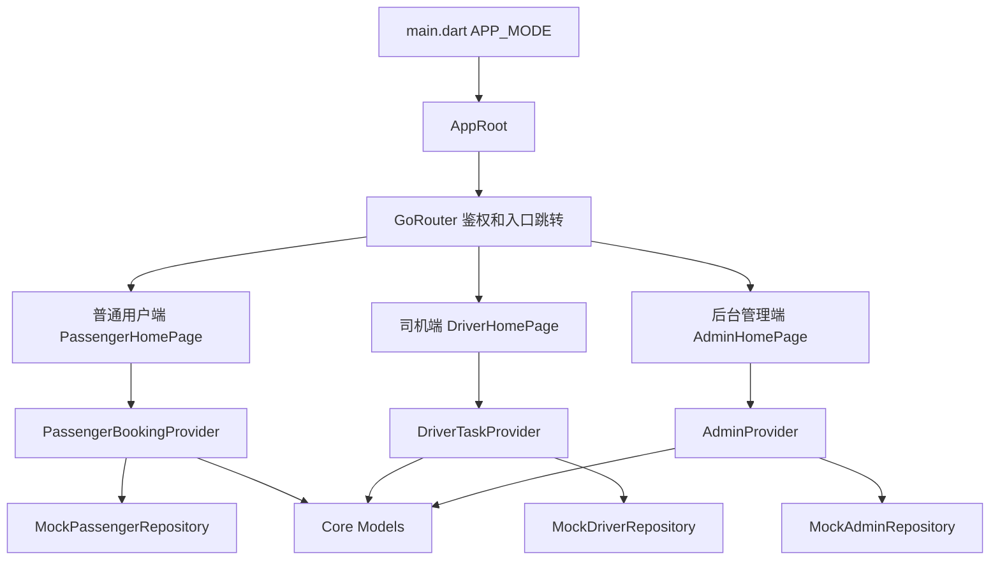

# 项目设计

## 课程工具标识

`[课程工具标识: UML/PlantUML + 架构设计文档]` 本部分使用 UML 组件图、类图、顺序图和活动图描述系统设计，PlantUML 源文件位于 `docs/uml/component_diagram.puml`、`docs/uml/class_diagram.puml`、`docs/uml/driver_location_sequence.puml` 和 `docs/uml/dispatch_activity.puml`。

## 设计目标

| 目标 | 说明 |
| --- | --- |
| 三端复用 | 普通用户端、司机端和后台端共用 Flutter 工程、主题、路由、模型和状态管理能力 |
| 原型可运行 | 在没有真实后端、支付和地图服务的情况下，通过 Mock Repository 完成功能闭环 |
| 模块清晰 | 按 `core`、`features`、`shared` 拆分代码，降低功能之间耦合 |
| 易测试 | 将业务逻辑放入 Riverpod Provider，页面通过 Widget Test 验证关键流程 |
| 可扩展 | Mock 数据层可替换为 REST API、WebSocket、真实支付和地图 SDK |

## 总体架构

系统采用 Flutter 单工程多入口架构。`main.dart` 读取 `APP_MODE` 环境变量，初始化普通用户、司机或后台管理端入口。三端共享 `AppRoot`、`GoRouter`、主题、用户模型和业务模型，不同功能页面放在 `features` 目录下。



## 技术架构

| 层级 | 技术或目录 | 职责 |
| --- | --- | --- |
| 表现层 | `features/*/presentation` | 页面布局、弹窗、表单和用户交互 |
| 状态层 | `features/*/providers`、`core/providers` | 登录态、入口模式、预约状态、司机任务、后台管理状态 |
| 数据层 | `features/*/data` | Mock 数据仓库，模拟后端查询和业务初始数据 |
| 模型层 | `core/models` | 用户、车次、预约、支付、车辆、司机、调度、位置、分析数据模型 |
| 路由层 | `core/router` | 使用 GoRouter 根据登录态和角色控制访问 |
| 共享层 | `shared/widgets` | 三端共用入口切换和卡片组件 |

## 目录设计

```text
lib/
├── main.dart
├── app.dart
├── core/
│   ├── models/
│   ├── providers/
│   ├── router/
│   └── theme/
├── features/
│   ├── auth/
│   ├── passenger/
│   ├── driver/
│   └── admin/
└── shared/
    └── widgets/
```

## 入口和路由设计

| 文件 | 设计说明 |
| --- | --- |
| `lib/main.dart` | 读取 `APP_MODE`，通过 `ProviderScope` 注入初始入口模式 |
| `lib/app.dart` | 构建 `MaterialApp.router`，应用主题和路由配置 |
| `lib/core/router/app_router.dart` | 根据登录状态和角色重定向，禁止跨角色访问其它端页面 |
| `lib/core/models/app_mode.dart` | 定义 `passenger`、`driver`、`admin` 三种入口及首页路径 |

路由策略为：未登录或角色不匹配时重定向到 `/login`；登录成功后进入当前模式对应首页；如果用户直接访问其它端路径，系统自动重定向到当前角色首页。

## 普通用户端设计

| 模块 | 设计 |
| --- | --- |
| 车次列表 | 从 `PassengerBookingState.trips` 读取车次，过滤可预约和有余座车次 |
| 预约座位 | 弹窗展示可用座位，提交时校验车次状态、余座、重复预约和座位占用 |
| 我的预约 | 支持按预约状态筛选，展示座位、费用、车次和支付状态 |
| 支付 | 选择微信支付或支付宝，生成 `PaymentModel`，模拟支付中到已支付状态 |
| 信用 | 取消预约时调用 `adjustCreditScore` 扣分，信用面板展示等级和扣分记录 |
| 通知 | 预约、支付、取消扣分产生 `AppNotificationModel`，页面展示未读数量和通知中心 |

## 司机端设计

| 模块 | 设计 |
| --- | --- |
| 派车任务 | `DriverTaskModel` 包含车次号、路线、车辆、距离、状态和乘客上车点 |
| 统计看板 | `DriverStats` 按日、周、月存储完成车次、服务人次、行驶里程和准点率 |
| 实时位置 | 开始任务后状态变为运行中，`Timer.periodic` 每 5 秒追加 `LocationUpdate` |
| 到站完成 | 停止 Timer，任务状态变为已完成，位置共享状态变为未开启 |

## 后台管理端设计

| 模块 | 设计 |
| --- | --- |
| 车辆管理 | 支持新增、编辑、删除车辆；运行中车辆不可删除 |
| 司机管理 | 支持新增、编辑、删除司机；车辆绑定保持一车一司机；在途司机不可删除 |
| 预约需求汇总 | `DispatchDemandModel` 聚合路线、人数和发车时间 |
| 人工调度 | 管理员手动选择空闲车辆和司机，系统校验座位数和绑定关系 |
| AI 辅助调度 | 按预约人数降序遍历需求，匹配空闲且已绑定司机的车辆生成推荐方案 |
| 调度确认 | 需求改为已调度，车辆改为运行中，司机绑定车辆，生成位置记录 |
| 实时监控 | Mock 地图展示在途车辆标记，点击后展示车次、司机、速度、坐标和更新时间 |
| 客户 ETA | `PassengerEtaPanel` 展示预约客户上车点、距离和预计到达时间 |
| 历史分析 | 按日、周、月展示人次、收入、车辆利用率、趋势图和路线热度排行 |

## 核心数据模型

| 模型 | 关键字段 | 用途 |
| --- | --- | --- |
| `UserModel` | `id`、`name`、`phone`、`creditScore`、`role` | 登录用户和信用信息 |
| `TripModel` | `routeName`、`origin`、`destination`、`departureTime`、`totalSeats`、`bookedSeats`、`fare`、`status` | 普通用户可预约车次 |
| `BookingModel` | `userId`、`tripId`、`seatNo`、`status`、`paymentStatus`、`creditPenalty` | 预约订单 |
| `PaymentModel` | `bookingId`、`amount`、`method`、`status` | 支付流水 |
| `DriverTaskModel` | `tripNo`、`routeName`、`vehicleId`、`passengers`、`distanceKm`、`status` | 司机派车任务 |
| `LocationUpdate` | `vehicleId`、`lat`、`lng`、`speed`、`timestamp` | 司机端位置上报 |
| `VehicleModel` | `plateNo`、`model`、`seatCount`、`status` | 后台车辆管理 |
| `AdminDriverModel` | `name`、`phone`、`licenseNo`、`boundVehicleId` | 后台司机管理 |
| `DispatchDemandModel` | `routeName`、`passengerCount`、`departureTime`、`status` | 预约需求汇总 |
| `DispatchPlanModel` | `vehicleId`、`driverId`、`loadRate`、`isAiGenerated`、`isConfirmed` | 调度方案 |
| `VehicleLocationModel` | `vehicleId`、`tripNo`、`driverId`、`lat`、`lng`、`speed` | 后台实时位置 |
| `AdminAnalyticsSnapshot` | `totalPassengers`、`totalRevenue`、`vehicleUtilization`、`trend`、`routeRanking` | 历史数据分析 |

## 状态管理设计

| Provider | 类型 | 状态内容 | 主要操作 |
| --- | --- | --- | --- |
| `appModeControllerProvider` | Riverpod Provider | 当前端入口 | 切换普通用户、司机、后台入口 |
| `authControllerProvider` | Riverpod Notifier | 登录用户、加载状态、错误信息 | 登录、退出、调整信用分 |
| `notificationProvider` | Riverpod Notifier | 通知列表 | 推送通知、全部已读 |
| `passengerBookingProvider` | Riverpod Notifier | 车次、预约、支付流水 | 预约、取消、支付 |
| `driverTaskProvider` | Riverpod Notifier | 司机任务、统计、位置上报 | 开始任务、上报位置、完成任务、切换统计周期 |
| `adminProvider` | Riverpod Notifier | 车辆、司机、位置、调度、分析 | CRUD、调度、确认、位置刷新、统计切换 |

## AI 调度算法设计

当前 AI 辅助调度采用规则引擎模拟。算法目标是在课程原型中提供可解释、可演示的自动推荐能力。

算法步骤：

1. 获取所有空闲车辆。
2. 过滤出已经绑定司机的车辆，形成车辆司机候选对。
3. 获取待调度需求，并按 `passengerCount` 从大到小排序。
4. 对每个需求选择第一辆未使用且座位数满足人数的车辆。
5. 生成 `DispatchPlanModel`，标记 `isAiGenerated=true`。
6. 管理员确认后方案生效，车辆状态改为运行中。

复杂度分析：需求数为 `n`、候选车辆数为 `m`，当前实现近似为 `O(n*m)`，对课程原型和校园车队规模足够。

## 实时位置设计

| 端 | 设计 |
| --- | --- |
| 司机端 | 发车后立即生成一次位置记录，并每 5 秒追加一次 Mock 经纬度和速度 |
| 后台端 | 初始化时读取运行中车辆位置，每 5 秒模拟刷新运行中车辆坐标 |
| 地图显示 | 使用 Flutter `Stack` 和 `CustomPaint` 绘制 Mock 地图网格和车辆标记 |
| 扩展方案 | 正式版本可将 `Timer.periodic` 替换为 GPS 采集和 WebSocket 上报订阅 |

## 异常和校验设计

| 场景 | 处理 |
| --- | --- |
| 登录手机号为空 | 提示请输入手机号和密码 |
| 登录角色不匹配 | 提示当前入口不匹配 |
| 重复预约 | 阻止提交并提示不能重复预约 |
| 车次已满座 | 阻止预约并提示已满座 |
| 已完成预约取消 | 阻止取消并提示只有待发车预约可以取消 |
| 运行中车辆删除 | 阻止删除并提示运行中车辆不可删除 |
| 司机绑定冲突 | 阻止保存并提示车辆已绑定其他司机 |
| 座位数不足调度 | 阻止人工调度并提示车辆座位数不足 |
| 无可调度车辆 | AI 调度返回失败提示 |

## UI 设计

系统使用 Material 组件构建工作台式界面。三端首页顶部为摘要卡片，中部为功能面板，底部为列表或图表。后台端在宽屏下采用左右分栏，在窄屏下改为上下排列。主题通过 `AppTheme.light(mode)` 根据端类型提供一致但可区分的视觉风格。

## 可扩展接口设计

| 当前 Mock 模块 | 正式版本替换方向 |
| --- | --- |
| `MockAuthRepository` | REST 登录接口、Token 和安全存储 |
| `MockPassengerRepository` | 车次、预约和支付后端 API |
| `MockDriverRepository` | 司机任务 API、GPS 采集服务、WebSocket 位置上报 |
| `MockAdminRepository` | 车辆司机管理 API、实时订阅、数据分析 API |
| Mock 地图 | 高德地图、腾讯地图、OpenStreetMap 或 Flutter Map |
| Mock 支付 | 微信支付、支付宝 SDK 或学校统一支付平台 |

## 设计和源码映射

| 设计内容 | 源码路径 |
| --- | --- |
| 应用入口 | `lib/main.dart`、`lib/app.dart` |
| 路由鉴权 | `lib/core/router/app_router.dart` |
| 登录 | `lib/features/auth/` |
| 普通用户端 | `lib/features/passenger/` |
| 司机端 | `lib/features/driver/` |
| 后台端 | `lib/features/admin/` |
| 公共模型 | `lib/core/models/` |
| 自动化测试 | `test/widget_test.dart` |
