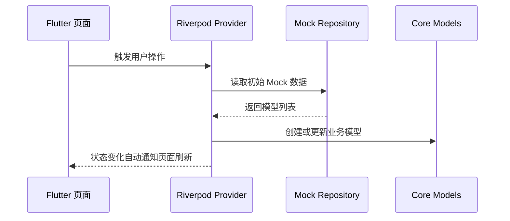

# 项目源码说明

## 课程工具标识

`[课程工具标识: Flutter/Dart + Android Studio/VS Code + Git]` 本部分对应“项目源码”要求。项目源码使用 Flutter 和 Dart 开发，依赖通过 `pubspec.yaml` 管理，版本通过 Git 管理，自动化测试位于 `test/widget_test.dart` 和 `test/business_rule_test.dart`。

## 源码概况

| 项目 | 内容 |
| --- | --- |
| 工程名称 | `school_bus_app` |
| 工程目录 | `/home/assumeengage/small_flutter_project/bus_flutter` |
| 主要语言 | Dart |
| 运行框架 | Flutter |
| 状态管理 | Riverpod |
| 路由管理 | GoRouter |
| 数据来源 | Mock Repository + Supabase 可切换后端骨架 |
| 测试框架 | Flutter Test |

## 运行环境

| 环境项 | 要求 |
| --- | --- |
| Flutter | Flutter 3.x |
| Dart SDK | `^3.11.5`，见 `pubspec.yaml` |
| 平台 | Android、iOS、Web、Linux、macOS、Windows 均有 Flutter 工程目录支持 |
| 当前验证平台 | Linux 开发环境 |

## 依赖说明

| 依赖 | 版本 | 用途 |
| --- | --- | --- |
| `flutter_riverpod` | `^3.3.1` | 状态管理，管理登录态、预约、任务、后台数据 |
| `go_router` | `^17.2.2` | 路由和登录鉴权跳转 |
| `cupertino_icons` | `^1.0.8` | 图标支持 |
| `supabase_flutter` | `^2.12.4` | 可切换后端骨架，未配置时回退 Mock |
| `flutter_lints` | `^6.0.0` | Dart/Flutter 代码规范检查 |
| `flutter_test` | SDK 内置 | Widget 自动化测试 |

## 启动命令

```bash
flutter pub get

# 普通用户端
flutter run --dart-define=APP_MODE=passenger

# 司机端
flutter run --dart-define=APP_MODE=driver

# 后台管理端，建议 Web 演示
flutter run -d chrome --dart-define=APP_MODE=admin
```

## Mock 账号

| 入口 | 手机号 | 密码 | 角色 |
| --- | --- | --- | --- |
| 普通用户端 | `13800000001` | `123456` | 张同学 |
| 司机端 | `13800000002` | `123456` | 王师傅 |
| 后台管理端 | `13800000003` | `123456` | 李管理员 |

## 源码目录结构

```text
lib/
├── main.dart
├── app.dart
├── core/
│   ├── models/
│   ├── providers/
│   ├── router/
│   └── theme/
├── features/
│   ├── auth/
│   ├── passenger/
│   ├── driver/
│   └── admin/
└── shared/
    └── widgets/
```

## 入口源码

| 文件 | 说明 |
| --- | --- |
| `lib/main.dart` | 读取 `APP_MODE` 环境变量并注入初始端模式 |
| `lib/app.dart` | 构建 `MaterialApp.router`，绑定主题和路由 |
| `lib/core/router/app_router.dart` | 配置登录页和三端首页，按登录态和角色进行重定向 |
| `lib/core/router/app_routes.dart` | 维护路由路径常量 |
| `lib/core/providers/app_mode_provider.dart` | 管理当前端入口 |

## 登录模块

| 文件 | 说明 |
| --- | --- |
| `lib/features/auth/presentation/login_page.dart` | 登录界面和 Mock 账号快捷填充 |
| `lib/features/auth/data/mock_auth_repository.dart` | Mock 账号、登录校验和角色匹配校验 |
| `lib/features/auth/data/auth_state.dart` | 登录状态数据结构 |
| `lib/core/providers/auth_provider.dart` | 登录、退出、调整信用分的状态控制器 |

## 普通用户端源码

| 文件 | 说明 |
| --- | --- |
| `lib/features/passenger/presentation/passenger_home_page.dart` | 普通用户工作台，包含预约、我的预约、支付、信用和通知 UI |
| `lib/features/passenger/booking/providers/passenger_booking_provider.dart` | 预约、取消、扣分、支付业务逻辑 |
| `lib/features/passenger/booking/data/mock_passenger_repository.dart` | Mock 车次和历史预约数据 |
| `lib/core/models/trip_model.dart` | 车次模型 |
| `lib/core/models/booking_model.dart` | 预约模型 |
| `lib/core/models/payment_model.dart` | 支付模型 |
| `lib/core/providers/notification_provider.dart` | Mock 推送通知状态管理 |

普通用户端功能实现点：

| 功能 | 关键方法或组件 |
| --- | --- |
| 预约车次 | `createBooking`、`_showSeatDialog` |
| 查看预约 | `bookingsForUser`、`_BookingList` |
| 取消预约 | `cancelBooking`、`_confirmCancelBooking` |
| 支付车费 | `payBooking`、`_showPaymentDialog` |
| 信用等级 | `_CreditPanel`、`adjustCreditScore` |
| 通知中心 | `_NotificationPanel`、`_NotificationSheet` |

## 司机端源码

| 文件 | 说明 |
| --- | --- |
| `lib/features/driver/presentation/driver_home_page.dart` | 司机工作台，包含统计、实时位置、任务列表和乘客名单 |
| `lib/features/driver/tasks/providers/driver_task_provider.dart` | 司机任务状态、位置上报和统计切换逻辑 |
| `lib/features/driver/tasks/data/mock_driver_repository.dart` | Mock 司机任务和统计数据 |
| `lib/core/models/driver_task_model.dart` | 司机任务、乘客上车点和统计模型 |
| `lib/core/models/location_update.dart` | 司机端位置上报模型 |

司机端功能实现点：

| 功能 | 关键方法或组件 |
| --- | --- |
| 查看派车任务 | `_TaskList`、`_TaskCard` |
| 查看乘客名单和上车点 | `PassengerPickup`、`ExpansionTile` |
| 日周月统计 | `_StatsPanel`、`selectStatsPeriod` |
| 开始任务并共享位置 | `startTask`、`_appendLocationUpdate` |
| 到站完成 | `completeActiveTask` |

## 后台管理端源码

| 文件 | 说明 |
| --- | --- |
| `lib/features/admin/presentation/admin_home_page.dart` | 后台工作台，包含车辆、司机、调度、监控、ETA 和分析页面 |
| `lib/features/admin/providers/admin_provider.dart` | 后台车辆司机 CRUD、位置刷新、调度和分析状态管理 |
| `lib/features/admin/data/mock_admin_repository.dart` | Mock 车辆、司机、位置、需求和分析数据 |
| `lib/core/models/vehicle_model.dart` | 车辆模型 |
| `lib/core/models/admin_driver_model.dart` | 后台司机模型 |
| `lib/core/models/dispatch_model.dart` | 调度需求和调度方案模型 |
| `lib/core/models/vehicle_location_model.dart` | 后台车辆实时位置模型 |
| `lib/core/models/analytics_model.dart` | 历史数据分析模型 |

后台端功能实现点：

| 功能 | 关键方法或组件 |
| --- | --- |
| 车辆管理 | `addVehicle`、`updateVehicle`、`deleteVehicle`、`_VehiclePanel` |
| 司机管理 | `addDriver`、`updateDriver`、`deleteDriver`、`_DriverPanel` |
| 人工调度 | `createManualDispatchPlan`、`_ManualDispatchDialog` |
| AI 辅助调度 | `generateAiDispatchPlans` |
| 调度确认 | `confirmDispatchPlan` |
| 实时位置监控 | `_TrackingPanel`、`_MockMap`、`_VehicleTrackingDetail` |
| 预约客户 ETA | `_PassengerEtaPanel` |
| 历史数据分析 | `_AnalyticsPanel`、`_TrendChart`、`_RouteRanking` |

## 数据流说明



## 与需求的对应关系

| 需求 | 源码实现 |
| --- | --- |
| 预约车次、取消、查看 | `passenger_home_page.dart`、`passenger_booking_provider.dart` |
| 车费支付 | `payment_model.dart`、`payBooking` |
| 信用等级 | `UserModel.creditScore`、`_CreditPanel` |
| 司机派车任务 | `driver_home_page.dart`、`DriverTaskModel` |
| 司机统计 | `DriverStats`、`_StatsPanel` |
| 司机实时位置共享 | `LocationUpdate`、`Timer.periodic` |
| 车辆管理 | `VehicleModel`、`AdminController` |
| 司机管理 | `AdminDriverModel`、`AdminController` |
| 调度车次 | `DispatchDemandModel`、`DispatchPlanModel`、`generateAiDispatchPlans` |
| 车辆位置监控 | `VehicleLocationModel`、`_MockMap` |
| 客户距离和 ETA | `_PassengerEtaPanel` |
| 历史数据分析 | `AdminAnalyticsSnapshot`、`_AnalyticsPanel` |

## 已实现原型边界

当前项目是课程大作业原型，以下能力使用 Mock 方式实现：

| 能力 | 当前实现 | 后续扩展 |
| --- | --- | --- |
| 用户登录 | Mock 账号和密码 | 后端登录、Token、权限表 |
| 支付 | Mock 微信支付和支付宝 | 接入学校支付平台或支付 SDK |
| 实时位置 | 定时模拟经纬度 | 手机 GPS 和 WebSocket |
| 地图 | Flutter 绘制 Mock 地图 | 高德地图、腾讯地图或 OSM |
| AI 调度 | 规则引擎推荐 | 调用优化算法或大模型辅助解释 |
| 数据持久化 | 内存状态 | 数据库和服务端 API |

## 测试入口

自动化测试文件为 `test/widget_test.dart` 和 `test/business_rule_test.dart`，覆盖普通用户、司机和后台管理端关键流程，以及角色入口、重复预约、不可取消、车辆删除、司机绑定和调度失败等负向业务规则。运行命令：

```bash
flutter test
```
