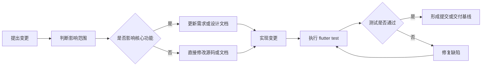

# 配置管理

## 课程工具标识

`[课程工具标识: Git + pubspec.lock + 版本基线管理]` 本部分对应“其它内容，比如配置管理”要求。项目使用 Git 管理源码和报告，使用 `pubspec.yaml` 与 `pubspec.lock` 管理 Flutter/Dart 依赖版本。

## 配置管理目标

| 目标 | 说明 |
| --- | --- |
| 可追溯 | 每次功能变更、文档变更和测试结果都有明确文件记录 |
| 可复现 | 通过锁定依赖和运行命令保证项目可重新构建和测试 |
| 可交付 | 明确提交包范围，避免漏交源码、报告或 UML 文件 |
| 可回退 | 通过 Git 历史记录支持版本回退和问题定位 |

## 配置项清单

| 配置项 | 路径 | 类型 | 管理方式 |
| --- | --- | --- | --- |
| Flutter 源码 | `lib/` | 源码 | Git 跟踪 |
| 自动化测试 | `test/` | 测试代码 | Git 跟踪 |
| 项目依赖 | `pubspec.yaml` | 配置 | Git 跟踪 |
| 依赖锁定 | `pubspec.lock` | 锁文件 | Git 跟踪 |
| 静态检查配置 | `analysis_options.yaml` | 配置 | Git 跟踪 |
| CI/CD 工作流 | `.github/workflows/flutter-ci-cd.yml` | 自动化配置 | Git 跟踪 |
| Supabase SQL | `supabase/` | 数据库配置 | Git 跟踪 |
| Android 工程 | `android/` | 平台工程 | Git 跟踪 |
| iOS 工程 | `ios/` | 平台工程 | Git 跟踪 |
| Web 工程 | `web/` | 平台工程 | Git 跟踪 |
| 桌面工程 | `linux/`、`macos/`、`windows/` | 平台工程 | Git 跟踪 |
| 项目报告 | `docs/` | 文档 | Git 跟踪 |
| UML 源文件 | `docs/uml/` | 设计文档 | Git 跟踪 |
| 技术方案 | `校车管理系统_技术方案.md` | 文档 | Git 跟踪 |
| README | `README.md` | 文档 | Git 跟踪 |

## 不纳入版本控制的内容

| 内容 | 原因 |
| --- | --- |
| `build/` | 编译产物，可重新生成 |
| `.dart_tool/` | 本地工具缓存，可重新生成 |
| IDE 临时文件 | 与个人开发环境相关 |
| `SUPABASE_URL`、`SUPABASE_ANON_KEY` | 环境相关配置，通过 `--dart-define` 或 GitHub Secrets 注入 |
| 真实密钥和支付证书 | 涉及安全风险，不提交到仓库 |

## 分支管理

| 分支 | 用途 |
| --- | --- |
| `main` | 课程大作业主线和最终提交基线 |
| `feature/*` | 功能开发分支，适合多人协作时使用 |
| `docs/*` | 文档整理分支，适合报告集中修改时使用 |
| `fix/*` | 缺陷修复分支，适合测试阶段修复问题 |

当前项目可采用单人开发简化流程：在 `main` 分支完成小步提交，确保每次提交后 `flutter test` 通过。

## 版本命名规则

| 版本 | 含义 |
| --- | --- |
| `v0.1.0` | Flutter 工程初始化和三端入口骨架 |
| `v0.2.0` | 普通用户端预约、取消和查看功能 |
| `v0.3.0` | 司机端任务、统计和位置共享功能 |
| `v0.4.0` | 后台车辆司机管理和实时监控功能 |
| `v0.5.0` | 调度、支付、信用、通知和数据分析功能 |
| `v1.0.0` | 课程大作业最终提交版本 |

## 提交信息规范

| 类型 | 说明 | 示例 |
| --- | --- | --- |
| `feat` | 新功能 | `feat: add passenger booking flow` |
| `fix` | 缺陷修复 | `fix: avoid ambiguous admin test label` |
| `docs` | 文档 | `docs: add project requirement report` |
| `test` | 测试 | `test: cover admin eta panel` |
| `refactor` | 重构 | `refactor: simplify dispatch state update` |
| `chore` | 构建或配置 | `chore: update flutter dependencies` |

## 变更控制流程



## 基线管理

| 基线 | 内容 | 验收条件 |
| --- | --- | --- |
| 需求基线 | `docs/02_项目需求.md`、`docs/uml/use_case_diagram.puml` | 功能需求、业务规则和验收标准完整 |
| 设计基线 | `docs/03_项目设计.md`、`docs/uml/*.puml` | 架构、模块、模型和核心流程完整 |
| 源码基线 | `lib/`、`test/`、`pubspec.yaml` | 三端功能可运行，测试通过 |
| 测试基线 | `docs/05_项目测试.md`、`test/widget_test.dart` | 关键主流程自动化测试通过 |
| 交付基线 | README、docs、源码、测试、配置文件 | 满足课程提交清单 |

## 构建和验证命令

| 命令 | 用途 |
| --- | --- |
| `flutter pub get` | 安装依赖 |
| `dart format lib test` | 格式化源码和测试 |
| `flutter test` | 执行自动化测试 |
| `flutter run --dart-define=APP_MODE=passenger` | 启动普通用户端 |
| `flutter run --dart-define=APP_MODE=driver` | 启动司机端 |
| `flutter run -d chrome --dart-define=APP_MODE=admin` | 启动后台管理端 |
| `flutter run --dart-define=BACKEND=mock --dart-define=APP_MODE=passenger` | 强制使用 Mock 后端 |
| `flutter run --dart-define=BACKEND=supabase --dart-define=SUPABASE_URL=... --dart-define=SUPABASE_ANON_KEY=...` | 使用 Supabase 后端 |

## CI/CD 管理

| 项目 | 内容 |
| --- | --- |
| 工作流文件 | `.github/workflows/flutter-ci-cd.yml` |
| 触发条件 | 推送到 `main`、创建指向 `main` 的 Pull Request、手动触发 |
| CI 步骤 | 安装依赖、格式检查、静态分析、自动化测试、Web 构建 |
| CD 步骤 | `main` 分支验证通过后部署 `build/web` 到 GitHub Pages |
| 部署入口 | 后台管理端 Web，使用 `--dart-define=APP_MODE=admin --dart-define=BACKEND=mock` 构建 |
| Pages 要求 | 仓库 `Settings > Pages > Build and deployment` 选择 `GitHub Actions` |

## Supabase 配置管理

| 项目 | 管理方式 |
| --- | --- |
| 数据库结构 | `supabase/migrations/202605110001_initial_schema.sql` |
| 演示数据 | `supabase/seed/202605110001_seed_demo_data.sql` |
| 本地运行配置 | 使用 `--dart-define=SUPABASE_URL=...` 和 `--dart-define=SUPABASE_ANON_KEY=...` |
| CI 默认策略 | 使用 `BACKEND=mock` 保证公开仓库构建不依赖私有 Supabase 项目 |
| GitHub Secrets | 后续如需真实后端 CI，可配置 `SUPABASE_URL` 和 `SUPABASE_ANON_KEY` |

## 发布和提交清单

最终提交前检查以下内容：

| 检查项 | 状态 |
| --- | --- |
| `flutter test` 全部通过 | 已通过 |
| README 包含启动方式和 Mock 账号 | 已包含 |
| 项目计划文件完整 | 已完成 |
| 需求和 UML 文件完整 | 已完成 |
| 设计和 UML 文件完整 | 已完成 |
| 源码说明完整 | 已完成 |
| 测试计划、用例和报告完整 | 已完成 |
| 配置管理文档完整 | 已完成 |
| 课程工具使用标识完整 | 已完成 |

## 交付包建议结构

```text
school_bus_app/
├── lib/
├── test/
├── docs/
├── android/
├── ios/
├── web/
├── linux/
├── macos/
├── windows/
├── pubspec.yaml
├── pubspec.lock
├── analysis_options.yaml
├── README.md
└── 校车管理系统_技术方案.md
```
