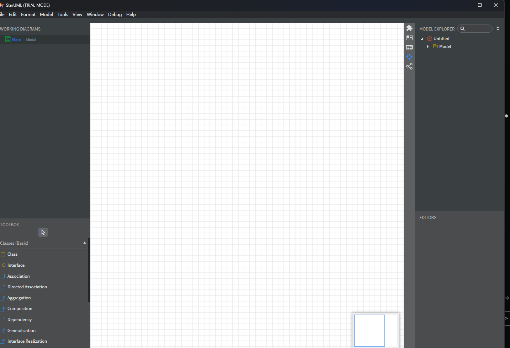
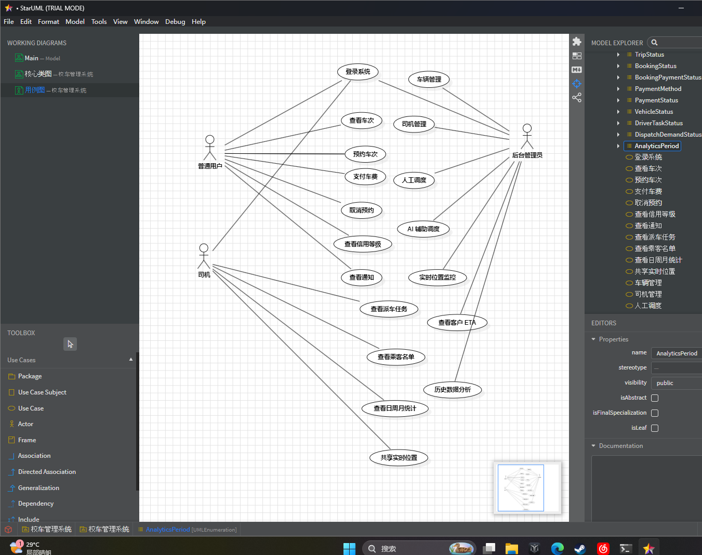
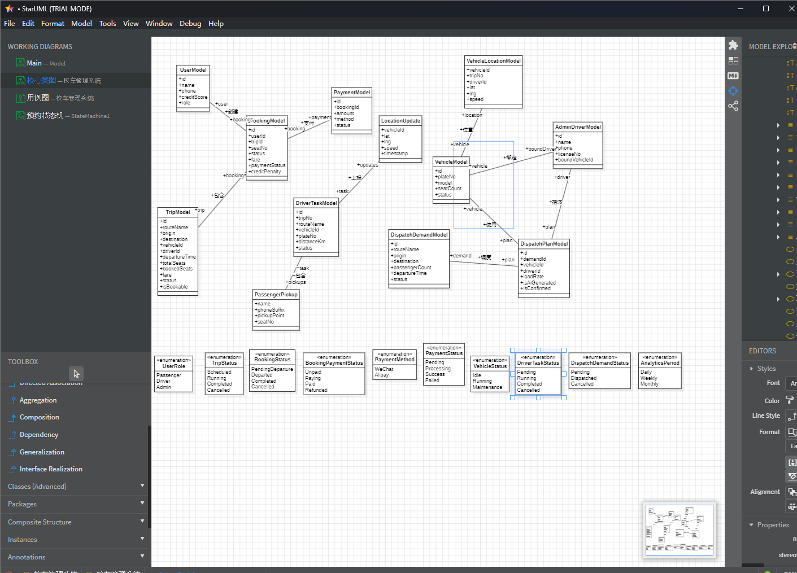
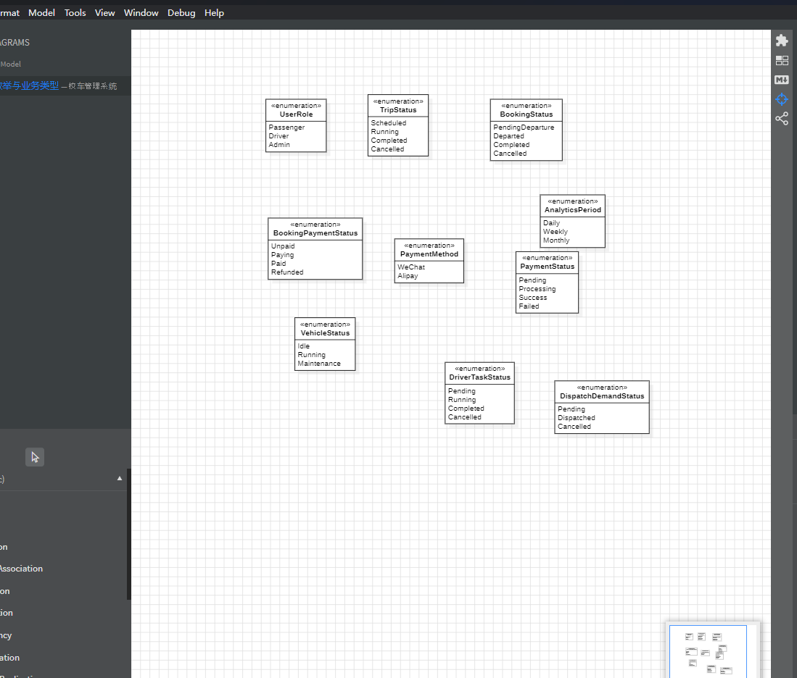
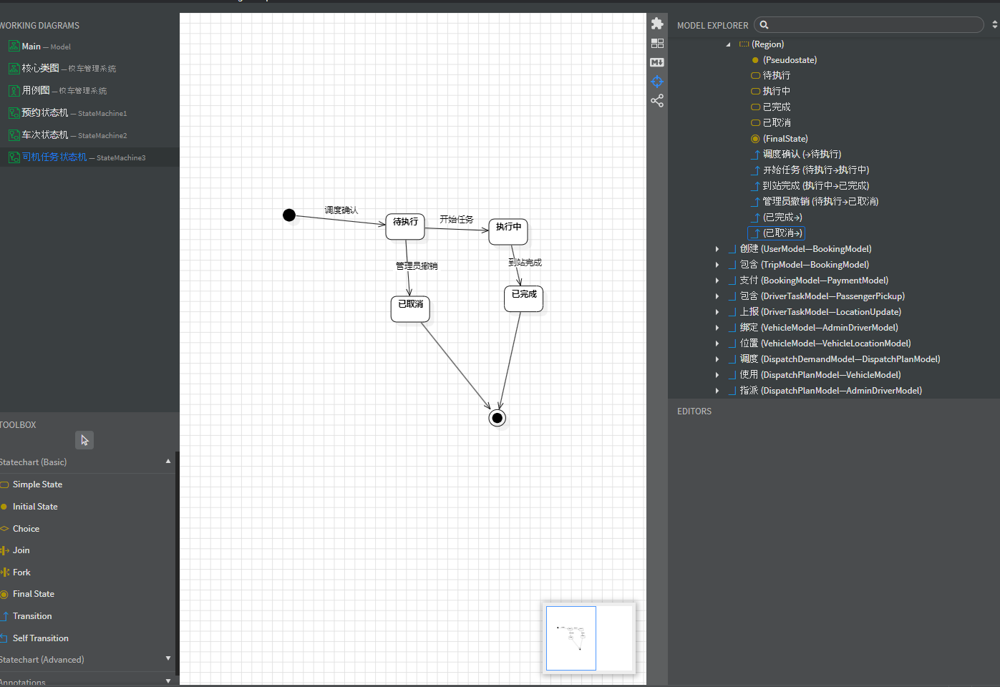
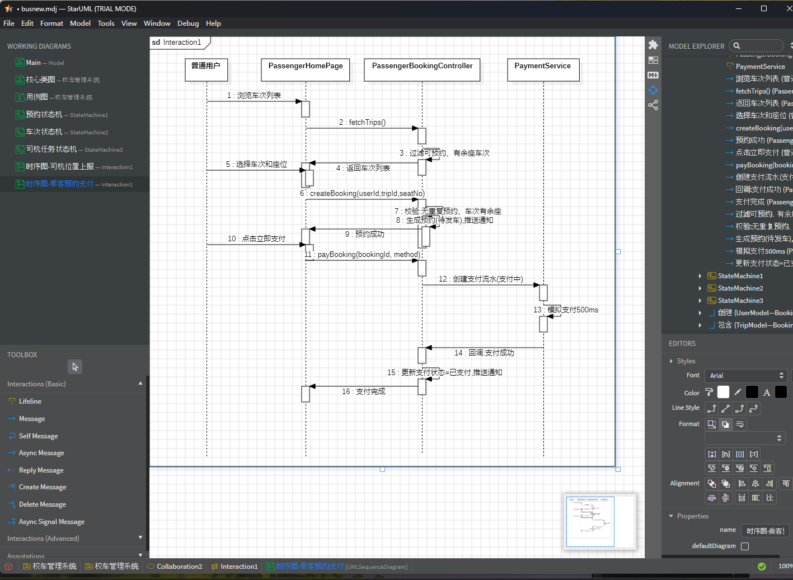
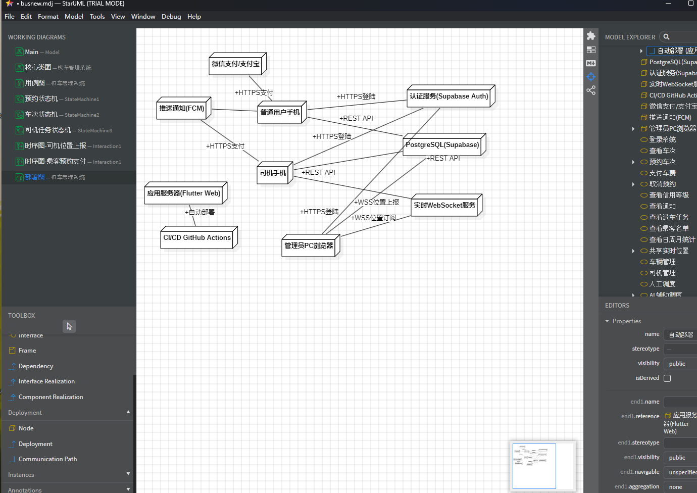
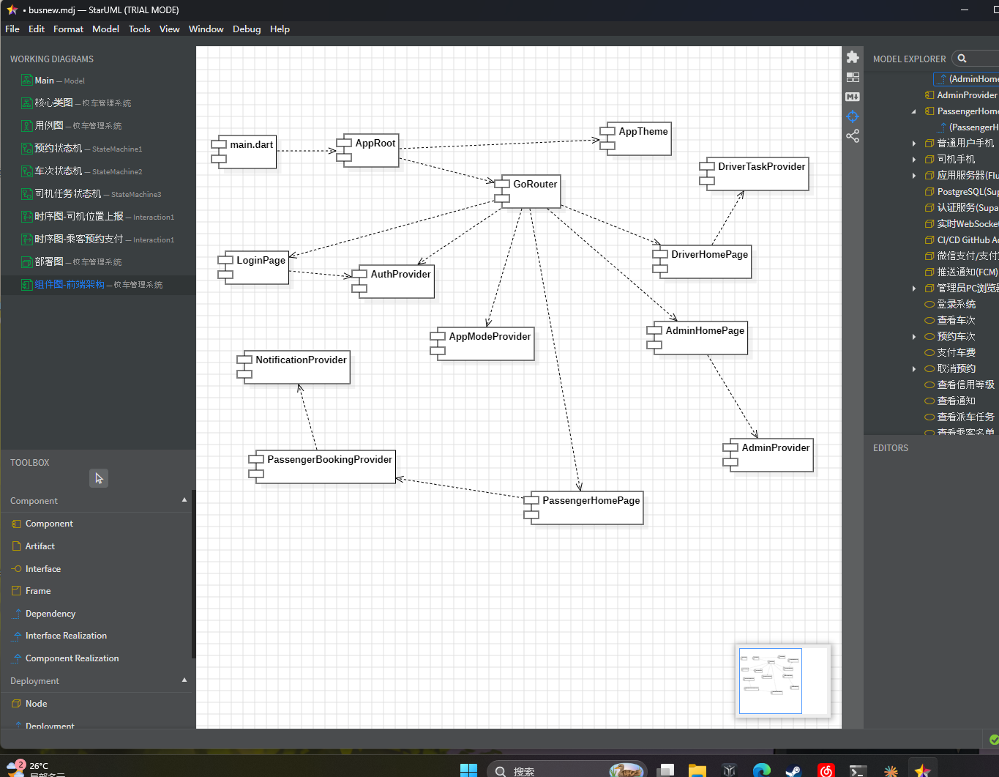

# StarUML 设计过程

> **课程**：软件开发环境与工具  
> **工具**：StarUML 6.3.0  
> **UML 源文件**：`docs/uml/BUS-FLUTTER-UML.mdj`  
> **导出图片**：`docs/uml/images/`（12 张 PNG）

---

## 1. 设计工具选择

根据课程第十五周上机实习要求，选用 **StarUML** 作为 UML 建模工具。StarUML 是一款开源的 UML 建模工具，支持全部 9 种 UML 图，具有语法检查、代码正反向工程、模式支持等功能。

工具获取：http://staruml.io/

---

## 2. 项目 UML 图清单

| 序号 | 图类型 | 图名称 | 说明 |
|:--:|------|------|------|
| 1 | 用例图 | 用例图-系统总览 | 三端全部用例及关系 |
| 2 | 用例图 | 用例图-乘客端 | 乘客端用例详图 |
| 3 | 类图 | 核心类图 | 13 个核心数据模型及关联 |
| 4 | 类图 | 类图-枚举与业务类型 | 10 个枚举类型 |
| 5 | 状态图 | 预约状态机 | BookingModel 生命周期 |
| 6 | 状态图 | 车次状态机 | TripModel 生命周期 |
| 7 | 状态图 | 司机任务状态机 | DriverTaskModel 生命周期 |
| 8 | 时序图 | 时序图-司机位置上报 | 司机→Controller→Timer 交互 |
| 9 | 时序图 | 时序图-乘客预约支付 | 乘客→Controller→Payment 交互 |
| 10 | 部署图 | 部署图 | 10 节点 + 12 条通信路径 |
| 11 | 组件图 | 组件图-前端架构 | 14 组件 + 14 条依赖 |
| 12 | 组件图 | 组件图-数据层与后端 | 20 组件 + 19 条依赖 |

---

## 3. 各图设计步骤

### 3.1 用例图（×2）

**设计依据**：项目需求文档 §3 用例清单（UC-01 ~ UC-18）

**作图步骤**：

1. 右键 Model → Add Diagram → Use Case Diagram
2. 从工具箱拖入 Actor（普通用户、司机、后台管理员）
3. 从工具箱拖入 Use Case 椭圆，命名对应 UC-01 ~ UC-18
4. 使用 Association 连接 Actor 与 Use Case
5. 使用 Dependency 连接 Include/Extend 关系，标注 `<<include>>` 或 `<<extend>>`
6. 乘客端详图仅保留普通用户 Actor 及其关联用例

**关键关系**：
- `<<include>>`：预约车次→查看车次、取消预约→信用等级、选座→预约车次
- `<<extend>>`：共享位置→查看任务、AI调度→人工调度、支付→预约、通知→取消

---

### 3.2 类图（×2）

**设计依据**：项目需求文档 §13 数据字典、源码 `lib/core/models/`

**核心类图步骤**：

1. 右键 Model → Add Diagram → Class Diagram
2. 拖入 13 个 Class，命名并添加属性和类型
3. 使用 Association 连接关联类，标注多重性（1、0..1、0..*）
4. 在关联线上标注角色名（创建、包含、支付、上报、绑定、调度、使用、指派）

**枚举类图步骤**：

1. 新建 Class Diagram
2. 逐一拖入 Enumeration 元素
3. 为每个枚举添加字面值（Literal）
4. 标注枚举用途

---

### 3.3 状态图（×3）

**设计依据**：项目需求文档 §12 业务规则、源码 `booking_model.dart` 等

**作图步骤**：

1. 右键 Model → Add Diagram → Statechart Diagram
2. 拖入 InitialState（实心圆）作为起点
3. 拖入 State 表示中间状态
4. 拖入 FinalState（实心圆+外圈）作为终点
5. 使用 Transition 箭头连接状态，标注转换条件
6. 三个状态机分别描述预约订单、车次、司机任务的生命周期

**状态机转换规则**：

| 状态机 | 主要路径 |
|--------|----------|
| 预约状态机 | 初始→待发车→待支付→已支付 / 已取消 / 已发车→运行中→已完成 |
| 车次状态机 | 初始→已排班→运行中→已完成 / 已取消 |
| 司机任务状态机 | 初始→待执行→执行中→已完成 / 已取消 |

---

### 3.4 时序图（×2）

**设计依据**：项目需求文档 §8 交互流程、源码 `driver_task_provider.dart`、`passenger_booking_provider.dart`

**作图步骤**：

1. 右键 Model → Add Diagram → Sequence Diagram
2. 拖入 Actor（司机/普通用户）和 Lifeline（页面、Controller、Service、Timer）
3. 使用 Message 工具从一条生命线拖到另一条，输入消息文本
4. 自环消息：从生命线拖出再拖回同一生命线
5. 在 Properties 面板调整 sequenceNumber 确保顺序正确

**司机位置上报交互链**：司机→DriverHomePage→DriverTaskController→Timer

**乘客预约支付交互链**：普通用户→PassengerHomePage→PassengerBookingController→PaymentService

---

### 3.5 部署图（×1）

**设计依据**：技术方案 §一 技术栈、源码 `supabase/` 配置

**作图步骤**：

1. 右键 Model → Add Diagram → Deployment Diagram
2. 拖入 10 个 Node（客户端设备、云服务器、数据库、第三方服务）
3. 使用 Association 拖线连接节点
4. 双击连线标注协议（HTTPS、REST、WSS）

**节点分组**：
- 客户端层：普通用户手机、司机手机、管理员PC浏览器
- 云服务层：应用服务器、PostgreSQL、认证服务、WebSocket服务
- 第三方层：微信支付/支付宝、推送通知FCM
- CI/CD层：GitHub Actions

---

### 3.6 组件图（×2）

**设计依据**：项目设计文档 §3 系统结构设计、源码 `lib/` 目录结构

**作图步骤**：

1. 右键 Model → Add Diagram → Component Diagram
2. 拖入 Component 元素，命名对应源码文件或模块
3. 使用 Dependency 虚线箭头连接依赖关系

**前端架构分层**：
- 入口层：main.dart→AppRoot
- 路由层：GoRouter→LoginPage/Passenger/Driver/Admin
- 业务层：各 Provider→对应 Repository
- 共享层：NotificationProvider、AppModeProvider、AuthProvider

**数据层架构**：
- 模型层：CoreModels 聚合 9 个数据模型
- 仓库层：Mock×3 + Supabase×3，双后端可切换
- 引导层：BackendBootstrap 统一管理初始化

---

## 4. 设计原则

| 原则 | 体现 |
|------|------|
| **高内聚** | 用例图按角色拆分、组件图按层拆分、状态图按对象拆分 |
| **低耦合** | 组件间通过 Dependency 弱依赖，Repository 可热替换 |
| **信息隐藏** | 页面只通过 Provider 访问数据，不直接操作 Repository |
| **图文一致** | 每张 UML 图均与源码、需求文档一一对应 |

---

## 5. 图片导出

StarUML → File → Export Diagram → PNG → 保存至 `docs/uml/images/`

| 文件名 | 对应图 |
|--------|--------|
| `usecase_overview.png` | 用例图-系统总览 |
| `usecase_passenger.png` | 用例图-乘客端 |
| `class_core.png` | 核心类图 |
| `class_enums.png` | 类图-枚举与业务类型 |
| `state_booking.png` | 预约状态机 |
| `state_trip.png` | 车次状态机 |
| `state_drivertask.png` | 司机任务状态机 |
| `sequence_driver.png` | 时序图-司机位置上报 |
| `sequence_passenger.png` | 时序图-乘客预约支付 |
| `deployment.png` | 部署图 |
| `component_frontend.png` | 组件图-前端架构 |
| `component_backend.png` | 组件图-数据层与后端 |

---

---

## 6. 设计过程截图清单

| 文件名 | 内容 | 说明 |
|--------|------|------|
| `process_staruml_main.png` | StarUML 主界面 | 软件启动后界面截图 |
| `process_usecase.png` | 用例图设计过程 | 拖入 Actor、Use Case、连线操作 |
| `process_class.png` | 类图设计过程 | 拖入 Class、添加属性、连线操作 |
| `process_class_enums.png` | 枚举类图设计过程 | 拖入 Enumeration、添加字面值 |
| `process_state.png` | 状态图设计过程 | 拖入 State、InitialState、Transition |
| `process_sequence.png` | 时序图设计过程 | 拖入 Lifeline、Message 连线 |
| `process_deployment.png` | 部署图设计过程 | 拖入 Node、Association 连线 |
| `process_component.png` | 组件图设计过程 | 拖入 Component、Dependency 连线 |

> 以上截图保存至 `docs/uml/images/`，命名与上表一致即可自动关联。

---

> **文档版本**：v1.0  
> **生成日期**：2026-06-14  
> **工具链**：StarUML 6.3.0 (UML建模) + Markdown (文档编写)
